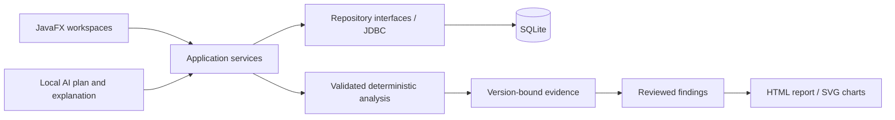

# ResearchFlow AI: current features and suggestions

Status: historical review baseline. The P1 issues and active-version freshness were subsequently addressed; see the
[implementation report](docs/INTEGRITY_IMPLEMENTATION_REPORT.md) for completed fixes, V005 compatibility limits,
and the final 119-test clean-build result. The observations below describe the pre-fix code.

Review date: 9 September 2026  
Baseline: the current working directory, including uncommitted and untracked implementation files.

## 1. Assessment and review scope

ResearchFlow AI is a local-first JavaFX desktop application supporting the research data lifecycle: study setup, form design, response collection or CSV import, dataset inspection and correction, quality review, dataset snapshots, deterministic analysis, optional local-AI questions, researcher-approved findings, and HTML reporting.

The core workflow is implemented and connected through the application navigation. Its strongest aspects are typed answer validation, separation of UI/services/persistence, deterministic statistics behind both manual and AI workflows, and evidence linked to dataset versions. The next development effort should focus on data-integrity edge cases and release readiness before expanding the statistical or AI scope.

This review examined the repository structure, build configuration, navigation and workspaces, domain types, services, persistence and migrations, analysis and AI pipelines, quality rules, import, chart/report implementation, tests, and existing architecture/roadmap documents. Findings below are based on local source inspection and the existing automated suite; this is not a line-by-line formal audit. No interactive desktop walkthrough, real-model evaluation, or new performance benchmark was performed. Existing documentation and the original DOCX are supporting project material, not proof that a feature works.

### Verification performed

```powershell
mvn -o "-Dmaven.repo.local=D:\research_flow\.tools\m2" test
```

- Result: **BUILD SUCCESS; 99 tests, 0 failures, 0 errors, 0 skipped**.
- Environment: workspace Maven installation and JDK 26; dependencies were available in the local cache.
- Maven reported existing compiled classes up to date; this was a test run, not a clean rebuild.
- Existing coverage includes unit, SQLite integration, AI adapter, import, chart, and report tests. It does not establish complete UI or production readiness.
- The existing architecture document reports 91 tests; this review observed 99.

## 2. Technology and architecture

| Area | Current implementation |
|---|---|
| Language/build | Java compiler release 25; Maven; application version `0.1.0-SNAPSHOT` |
| Desktop UI | JavaFX Controls 21.0.8; programmatic views; shared CSS theme |
| Storage | Embedded SQLite through sqlite-jdbc 3.53.1.0; no database server |
| Tests | JUnit Jupiter 5.13.4; Maven Surefire |
| AI transport | Java HTTP client targeting an Ollama-compatible runtime |
| Charts | Shared chart specification rendered by JavaFX in-app and SVG in reports |
| Export | Self-contained UTF-8 HTML with inline SVG |
| Background work | Executor-backed `Async`, with UI callbacks through `Platform.runLater` |
| Configuration | Environment variables and Java system properties; properties take precedence |

These are repository-pinned versions, not a claim about the latest available releases.



The package boundaries are clear: `app` assembles dependencies; `ui` implements interaction; `domain` holds immutable data; `service` owns use cases; `persistence` owns SQL. Dedicated packages cover form states, quality handlers, review commands, analysis strategies, AI adaptation, CSV import, visualization, reporting, and logging.

Implemented patterns include Repository, Service Layer, State, Strategy, Chain of Responsibility, Command, Adapter, Facade, and a composition root for dependency injection. See [AppServices](src/main/java/researchflow/app/AppServices.java) and [current architecture](docs/architecture/CURRENT_IMPLEMENTED_ARCHITECTURE.md).

## 3. Current feature inventory

### 3.1 Study management and dashboard

- Create and edit study title, description, objectives, researcher, start/end dates, and research questions.
- Validate study input and persist changes locally.
- List studies, open a study, archive it, and optionally show archived studies.
- Display objectives and research questions on the dashboard.
- Show counts for forms, responses, open quality issues, dataset versions, analyses, and approved findings.
- Navigate between Dashboard, Form, Responses, Import, Dataset, Quality / Versions, Analysis, and Findings / Report.

Archiving prevents study metadata edits through `StudyService`, but does not consistently prevent mutations in child workspaces; see section 5.

Sources: [StudyService](src/main/java/researchflow/service/StudyService.java), [StudiesHomeView](src/main/java/researchflow/ui/StudiesHomeView.java), [Navigator](src/main/java/researchflow/ui/Navigator.java).

### 3.2 Form builder and lifecycle

- Create multiple forms under a study, with titles and descriptions.
- Add, edit, delete, and reorder questions while a form is Draft.
- Configure variable keys, labels, help text, required flags, numeric bounds, and choice options.
- Support eight question types: Short text, Number, Single choice, Multiple choice, Yes/No, Likert, Rating, and Date.
- Preview the respondent controls before collecting data.
- Activate a nonempty form and collect responses; close an active form.
- Enforce Draft/Active/Closed state restrictions in the service layer.
- Maintain form version metadata and stable question UUIDs for dataset variables.

The domain supports sections, but the current builder edits a flattened question list into one section; a full section-management UI is not implemented. The builder also lacks a dedicated existing-form title/description editor and a clone/reopen workflow.

Sources: [FormWorkspaceView](src/main/java/researchflow/ui/FormWorkspaceView.java), [FormService](src/main/java/researchflow/service/FormService.java), [QuestionType](src/main/java/researchflow/domain/QuestionType.java).

### 3.3 Response collection

- Enter responses locally through controls generated from the form's question types.
- Validate required answers, numeric bounds, option membership, dates, and typed values.
- Collect only against an active form.
- Track submission time and duration when a start time is available.
- Persist response, answers, and submission audit together transactionally.
- Show saved response summaries and access response details through dataset inspection.

This is desktop collection; public survey URLs, a respondent web app, mobile collection, and remote synchronization are not implemented.

Sources: [RespondentEntryView](src/main/java/researchflow/ui/RespondentEntryView.java), [ResponseSubmissionService](src/main/java/researchflow/service/ResponseSubmissionService.java), [JdbcResponseRepository](src/main/java/researchflow/persistence/JdbcResponseRepository.java).

### 3.4 CSV dataset import

- Select a UTF-8 CSV file and preview a proposed column plan.
- Parse quoted fields, embedded commas/newlines, CRLF, and blank lines.
- Infer Short text, Number, or Date columns and generate sanitized, deduplicated variable keys.
- Review column labels, types, required flags, and whether columns are included.
- Create and activate a new form, then import rows through the normal response-validation pipeline.
- Skip invalid rows and return imported/skipped counts plus up to 25 row errors.
- Make imported data available to the normal dataset, quality, versioning, and analysis workflows.
- Leave imported response durations unset, avoiding fabricated fast-submission warnings.

Boundaries: reads the whole file into memory; creates a new form rather than appending; does not infer choice options or numeric bounds; does not import Excel/SPSS files. Setup and individual rows commit separately, so an unexpected failure can leave a partially completed import.

Sources: [DatasetImportService](src/main/java/researchflow/service/DatasetImportService.java), [dataimport package](src/main/java/researchflow/dataimport).

### 3.5 Dataset exploration and corrections

- Display a read-only grid with columns derived from stable question IDs.
- Page through results: the UI uses 50 rows, with repository requests bounded to 100.
- Search response IDs, form titles, and answer values.
- Filter by contains, equality, missing value, greater than, or less than, subject to variable type validation.
- Sort by submission time, duration, or variable values.
- Inspect response details and distinguish missing cells from ordinary display values.
- Correct individual answers through a dedicated dialog with typed validation, confirmation, and a required reason.
- Store correction history with previous/replacement values locally, and record an audit event without copying those values into its structured details.
- Show a study audit timeline, bounded to the newest 250 events.

Sources: [DatasetService](src/main/java/researchflow/service/DatasetService.java), [DatasetCorrectionService](src/main/java/researchflow/service/DatasetCorrectionService.java), [DatasetWorkspaceView](src/main/java/researchflow/ui/DatasetWorkspaceView.java).

### 3.6 Quality detection and review

| Rule | Implemented behavior |
|---|---|
| Missing required | Flags absent required answers |
| Invalid range | Flags numeric answers outside configured bounds |
| Duplicate response | Flags later identical answer sets within the same form |
| Outlier | Applies 1.5 × IQR fences to Number questions with at least four numeric values |
| Fast submission | Flags durations below `max(5, 2 × question count)` seconds; ignores unknown durations |

- Run all rules through a handler chain.
- Reconcile detected issues against existing active issues to avoid repeated duplicates.
- Inspect severity, explanation, status, and affected response/question.
- Filter issues by status and perform supported single/bulk review actions.
- Correct, exclude, accept, or defer with a reason/note and UI confirmation.
- Exclude responses by status rather than deleting their data.
- Record review audit events.

Bulk commands are applied independently. A failure can occur after earlier commands have succeeded. Quality correction and issue resolution also use separate transactions; this differs from the atomic answer-correction transaction itself.

Sources: [quality package](src/main/java/researchflow/quality), [QualityService](src/main/java/researchflow/service/QualityService.java), [QualityReviewService](src/main/java/researchflow/service/QualityReviewService.java).

### 3.7 Dataset versions

- Create study-wide answer snapshots with version number, parent, reason, change summary, creation time, and active flag.
- Preserve exclusion state alongside snapshot answers.
- List versions and identify the active version.
- Restore stored answer values/statuses from a selected version and record the operation as a new version, preserving earlier snapshots.
- Automatically create a baseline snapshot for analysis if no active version exists.
- Run analyses against stored snapshots rather than current live answers.

Important boundary: restore currently upserts captured answers and changes statuses of represented responses. It does not remove or deactivate data added after the target snapshot, so it is not an exact rollback of dataset membership. Snapshots are answer-based and do not independently capture responses containing zero answers.

Source: [JdbcVersionRepository](src/main/java/researchflow/persistence/JdbcVersionRepository.java).

### 3.8 Manual deterministic analysis

| Method | Current output |
|---|---|
| Frequency | Category counts, percentages, answered count, missing count; multiple-choice selections contribute to each selected category |
| Numeric summary | Count, missing count, mean, median, sample standard deviation, minimum, maximum |
| Correlation | Pearson correlation coefficient and paired sample count |
| Cross-tabulation | Row/column labels, contingency counts, total count |
| Two-group comparison | Group counts, means, standard deviations, mean difference, Welch t-statistic, degrees of freedom, Cohen's d |

- Choose a method, primary/secondary variables, an optional UI filter, and a dataset version.
- Validate variable existence, method/type compatibility, and filter values before execution.
- Exclude responses marked excluded in the selected snapshot.
- Persist method, plan, results, warnings, sample size, source, and version reference.
- Display evidence and history; history details expose stored plan/result/warnings JSON.
- Warn for sample sizes below 10, missingness above 20% of eligible responses, and non-causal interpretation of correlation/group comparisons.
- Reuse the same execution pipeline for AI-generated plans.

Multiple-choice percentages use respondents as the denominator and can sum above 100%. The service supports a list of conjunctive filters, while the manual UI exposes one filter row. No p-values, confidence intervals, regression, ANOVA, or nonparametric tests are implemented. The eligible-response denominator also needs the snapshot edge-case work described below.

Sources: [analysis package](src/main/java/researchflow/analysis), [AnalysisService](src/main/java/researchflow/service/AnalysisService.java), [AnalysisRunView](src/main/java/researchflow/ui/AnalysisRunView.java).

### 3.9 Ask Your Data / local AI

- Detect runtime/model availability and optionally auto-select an installed model.
- Accept a natural-language question about the study.
- Build a schema-aware prompt from question IDs, labels, types, and options.
- Parse the model response defensively into a supported structured analysis plan.
- Validate and execute that plan through the deterministic analysis service.
- Request a plain-language explanation of the computed evidence.
- Save successful question/answer turns linked to the analysis and store model/runtime/plan-prompt metadata with AI analyses.
- Display the transcript and evidence in the Analysis workspace.
- Handle unavailable runtime, timeout, malformed output, and explanation failure; keep manual analysis usable without AI.

Boundaries: one Ollama-compatible API adapter; no dedicated mid-request Cancel control; two sequential model calls; no general conversational-memory prompt or arbitrary research assistant. Explanations are constrained by prompts but are not independently checked for factual agreement with results. A configured nonlocal endpoint would receive prompts; local-first behavior depends on endpoint configuration.

Sources: [AnalysisFacade](src/main/java/researchflow/service/AnalysisFacade.java), [LocalLlmClient](src/main/java/researchflow/ai/LocalLlmClient.java), [AiPromptBuilder](src/main/java/researchflow/ai/AiPromptBuilder.java).

### 3.10 Charts and findings

- Build bar charts for frequency, flattened cross-tabulation, and group means.
- Build histograms for numeric summaries and scatter plots for correlations.
- Retrieve histogram/scatter values from the same version and filters as the analysis.
- Render charts in JavaFX and serialize their specifications for persistence/export.
- Draft a finding from freshly computed evidence with suggested editable wording and an optional chart.
- Preserve the analysis/version link when wording changes.
- List findings, filter statuses, edit wording, approve, or reject.
- Persist finding chart data so charts survive restarts.

Boundaries: no grouped-bar or box-plot implementation; no typed historical-analysis reconstruction for reopening old evidence and drafting directly from it. Editing an approved finding currently keeps its approval status, which needs revision control.

Sources: [visualization package](src/main/java/researchflow/visualization), [FindingService](src/main/java/researchflow/service/FindingService.java), [JdbcFindingRepository](src/main/java/researchflow/persistence/JdbcFindingRepository.java).

### 3.11 Reports

- Compose fresh reports from study metadata, form/response counts, active-version information, quality status totals, approved findings, and default limitations.
- Exclude draft/rejected findings from the report.
- Include saved evidence summaries, analysis/version references, and charts with findings.
- Show a native JavaFX preview and export self-contained HTML with inline SVG.
- Escape rendered content and record a report-generated audit event.
- Explain that older findings remain tied to their original versions after later changes.

Boundaries: no native PDF/DOCX export, report template editor, or saved report revision archive. Current summary counts may describe live data while findings describe older versions. File writing and audit insertion are separate operations.

Sources: [ReportService](src/main/java/researchflow/service/ReportService.java), [ReportHtmlRenderer](src/main/java/researchflow/report/ReportHtmlRenderer.java).

### 3.12 Persistence, configuration, and operational support

- Apply four registered migrations, V001–V004, tracked in `schema_migrations`.
- Use SQLite foreign keys, prepared values, transaction boundaries, and query indexes.
- Enable WAL, a 5-second busy timeout, and `synchronous=NORMAL`.
- Batch selected write-heavy repository operations, including snapshot writes/restores.
- Configure database path, logs, demo seeding, AI enablement, base URL, model, and timeout.
- Default to `data/researchflow.db`, `logs`, enabled demo seed, and `http://localhost:11434` with a 60-second AI timeout.
- Seed a demo study/form with eight responses illustrating quality issues when appropriate.
- Write structured JSON-line application logs and maintain database audit records.
- Provide shared styling, loading/empty/error states, and asynchronous database/model work.

There is no application backup/restore workflow, user authentication/roles, database encryption configuration, synchronization, checked-in Maven wrapper, installer build, or CI workflow in the inspected tree. Actor identifiers are local placeholders. Audit reasons and chat text remain user-entered data, so avoiding raw answer fields in audit payloads is not a complete privacy guarantee.

Sources: [AppConfig](src/main/java/researchflow/app/AppConfig.java), [ConnectionFactory](src/main/java/researchflow/persistence/ConnectionFactory.java), [migrations](src/main/resources/db/migration), [pom.xml](pom.xml).

## 4. What is already strong

1. **One numerical execution path.** AI chooses a supported plan; ordinary Java code calculates the result. This makes statistical behavior testable independently of a model.
2. **Explicit evidence provenance.** Analyses and findings retain dataset-version references, and charts use the same snapshot as their evidence.
3. **Controlled data changes.** Answers are validated at submission/correction boundaries; exclusions preserve original records; many writes include transactionally coupled audit events.
4. **Manageable architecture.** Small domain/service/repository boundaries make targeted fixes possible without redesigning the whole application.
5. **Useful automated coverage.** The 99 passing tests cover important workflow components and several rollback, parsing, and failure paths.
6. **Low operational overhead.** The desktop and embedded database support offline use after installation; AI is optional.

## 5. Priority findings and concrete suggestions

These are source-based findings and recommended work, not implemented fixes. Suggested regression scenarios below were not added or executed during this review.

### P1: address before relying on the app for important research records

| Finding and source | Impact | Suggested change and acceptance check |
|---|---|---|
| Restore only upserts snapshot rows: `JdbcVersionRepository.applySnapshot` | A response or previously missing answer added after v1 survives restoring v1; the new snapshot can differ from the selected version | Define exact restore semantics, track response membership independently, and preserve history while restoring absence/exclusion correctly. Test v1 → add response/add answer → restore v1 → compare membership and values. |
| Snapshots select from `answers`, not independently from `responses`: `snapshotCurrentAnswers` | An all-optional response with zero answers has no snapshot rows and disappears from the analysis denominator | Add response-level snapshot records and reconstruct empty responses. Test an entirely blank optional response and verify missing counts and warning denominators. |
| Wording edits retain `APPROVED` and its timestamp: `JdbcFindingRepository.updateText` | Changed wording can enter reports without renewed approval | Reset edited approved findings to Draft, clear approval metadata, and retain wording revisions. Test approve → edit → report excludes until reapproval. |
| Correcting an issue calls correction and resolution separately: `QualityReviewService.apply` | If resolution fails, the answer change persists while the issue remains unresolved | Combine the correction, correction history, issue transition, and audit writes in one transaction. Inject resolution failure and verify complete rollback. |
| Archived-study restrictions exist only in study metadata operations: `StudyService`, `FormService`, `Navigator` | An archived study can still be opened and modified through child workflows | Enforce a shared writable-study check on all modifying services and reflect it in controls. Test form creation, import, correction, review, versions, and findings after archive. |
| Review command target IDs are accepted separately from the loaded issue: `QualityReviewService.apply` | The service does not itself establish that the requested correction target matches the issue | Resolve targets from the issue or explicitly validate study/response/question ownership before any write. Test deliberately mismatched commands at the service boundary. |

### P2: reliability, evidence clarity, and release readiness

| Suggestion | Why / current evidence | Completion target |
|---|---|---|
| Make active-version freshness visible | `AnalysisService` uses an existing active snapshot even after live corrections or collection | Show pending live changes, snapshot date/count, and a clear create-new-version action before analysis. |
| Add backup and verified database recovery | Dataset versions reside in the same database and cannot recover a lost/corrupt database file | Provide a consistent SQLite backup operation, restore validation, and a documented recovery drill. |
| Reconstruct historical evidence | `AnalysisHistoryView` exposes raw JSON; finding creation depends on fresh evidence | Version stored schemas and decode historical results so users can reopen charts and create findings after restart. |
| Strengthen import completion semantics | `DatasetImportService` commits setup and rows separately and reads the full file | Offer explicit partial-import status, durable error output, progress/cancel, and streaming/chunking; test interruption after successful rows. |
| Make report export recoverable | `ReportService.export` writes the file before auditing | Use a temporary file and atomic finalization where supported; distinguish file success from audit failure and record a hash/export manifest. |
| Clarify mixed-version reports | Live counts/current quality summary can accompany historical approved findings | Display per-finding version/filter/warnings and explicitly label live versus snapshot summaries; optionally compose against one selected version. |
| Add task lifecycle management | `Async.run` returns no cancellation handle; callbacks can outlive the initiating view | Expose cancellable tasks, prevent duplicate submissions, and discard stale view callbacks. |
| Add automated desktop smoke checks | No JavaFX automation suite is present | Cover create → activate → submit/import → correct → snapshot → analyze → approve → export → restart. |
| Make builds and releases repeatable | No wrapper, CI workflow, or installer configuration is present | Add a Maven wrapper, CI test build, packaged runtime/installer, and fresh-machine smoke checklist. |
| Validate configuration early | `AppConfig` parses timeout directly and accepts the endpoint as text | Report actionable errors for malformed/invalid timeout values and URLs; show the chosen AI endpoint/model. |
| Improve JSON maintenance | Snapshot, AI, finding-chart, and logging code use separate narrow codecs | Add schema-version and escaping coverage; consolidate codecs where useful, including Unicode/control-character and malformed-input cases. |
| Align documentation with actual behavior | Architecture baseline says 91 tests and its diagram omits V004; restore wording is stronger than code behavior | Update architecture counts/diagram and describe exact restore and transaction boundaries. Add a tested end-to-end demonstration script. |

### P3: useful product additions after integrity work

- **Dataset portability:** export CSV plus a variable dictionary, with explicit choice between live data and a selected version.
- **Form productivity:** duplicate forms, edit draft metadata, manage sections, reuse question templates, and later add conditional branching if needed.
- **Richer exploration:** multiple filter rows, saved filters, variable missingness summaries, and clearer selection of populations across multiple forms.
- **Better charts:** grouped cross-tab bars, box plots, category limits, axis labels, and chart export controls.
- **Report usability:** editable report sections, templates, approved wording revisions, and PDF output if required by users.
- **AI transparency:** preview interpreted plans, constrain selectable variables/methods, display the selected version, and verify narrative numbers against evidence. Persist explanation prompt provenance as well as plan provenance.
- **Accessibility:** keyboard-only workflow checks, focus management, text scaling, readable validation, and narrow-window layouts.
- **Performance evidence:** repeatable benchmarks for import, scan, snapshot, analysis, and large-category charts; measure memory as well as elapsed time before changing storage architecture.
- **Statistical expansion:** add further methods only with explicit assumptions, independently checked reference cases, and adequate evidence/warning presentation.

Authentication, collaboration, cloud sync, public surveys, and mobile collection would be separate product expansions. They are not necessary to complete the existing local-desktop workflow.

## 6. Suggested implementation sequence

1. Fix snapshot membership/restore semantics and add edge-case regression tests.
2. Fix finding reapproval, archived-study enforcement, and quality-review transaction/ownership rules.
3. Add version-freshness indicators, recovery support, and explicit partial-operation reporting.
4. Implement historical evidence reconstruction and clearer report provenance.
5. Add desktop acceptance coverage, repeatable builds, installer packaging, and refreshed documentation.
6. Prioritize portability and form/report usability using actual researcher feedback; expand AI/statistics afterward.

The existing [development roadmap](docs/planning/DEVELOPMENT_ROADMAP.md) provides the broader phased plan. This sequence targets the gaps visible in the current implementation rather than treating planned capabilities as already delivered.

## 7. Review limits

- Tests passed on this machine; other operating systems and packaged distributions were not tested.
- No real Ollama model was queried, so explanation quality, hardware suitability, and real inference latency remain unverified.
- No benchmark was run; the README's 10,000-response performance statement was not independently reproduced here.
- Passing existing tests does not rule out the source-level gaps identified above.
- Only this report was added; existing project changes were preserved and no suggested application fixes were made.
