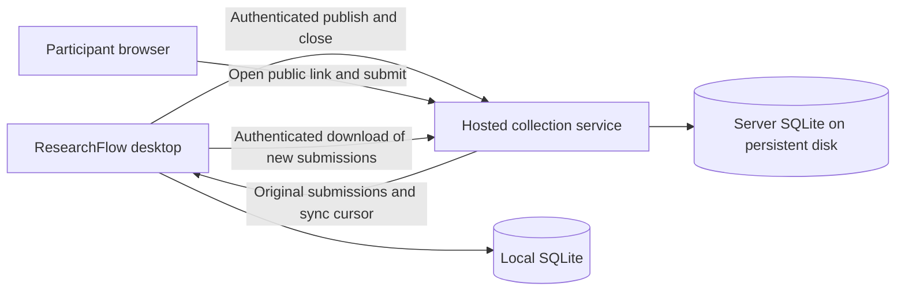

# Public forms and desktop synchronization: implementation plan

Status: Proposed, not implemented or deployed.

Confirmed requirements: Java desktop and backend, ordinary SQLite databases on both machines, hosted collection while the desktop is off, and a zero hosting budget. Hosting remains conditional on obtaining an eligible free VM; availability and uninterrupted service are not guaranteed.

Prepared: 9 September 2026. This extends ResearchFlow's JavaFX desktop application with hosted participant collection. The current user guide continues to describe implemented behavior only.

## 1. Intended experience

Create and activate a form in ResearchFlow, publish it online, copy its link, and send that link to participants. Participants fill it out in a browser on their phone or computer. A hosted service saves their submissions while the desktop is offline. ResearchFlow downloads new responses into the correct local study when the researcher synchronizes.

The desktop remains the workspace for cleaning, quality review, dataset snapshots, analyses, findings, and reports. These records do not need to be uploaded for public collection.

## 2. Working assumptions

These defaults make the first release concrete; they are not claims about expected demand or approved hosting expenditure.

| Decision | Proposed first release |
|---|---|
| Researcher access | One researcher/operator and one primary desktop installation; no public researcher signup |
| Participants | Anyone with the form link can submit without an account |
| Answer types | All eight existing types, including multiple choice, dates, Likert, and rating |
| Hosted data | Published questionnaire, collection state, original submissions, and minimal operational metadata |
| Desktop synchronization | Manual Sync responses initially; automatic polling deferred |
| Published form editing | Questionnaire stays immutable; changed questions require a new form/publication |
| Public collection | Open or permanently closed; reopening deferred |
| Response edits | Participants cannot edit after submission in the initial release |
| Attachments | No file uploads |
| Repeated submissions | Network retries deduplicated; one submission per real person is not guaranteed |
| Data volumes | Test a pilot of 10,000 submissions per form, 100 questions, and 20 concurrent submitters; measure before expanding |
| Backend and database | Java HTTP service with SQLite JDBC; one server instance with persistent disk |
| Costs | Free-allowance resources only; no paid upgrades or trial-credit-dependent infrastructure |

Participant identity, geographic storage requirements, retention period, and free-host account eligibility remain decisions before collecting real research data. Development and local testing can proceed without buying hosting.

## 3. Hosting from scratch

Proposed initial provider: **Oracle Cloud Infrastructure Always Free Compute**, subject to signup and capacity. Use a single Linux VM running the Java service and a normal SQLite file on attached persistent block storage. The service serves public HTML and its API from the same origin. No managed database subscription is needed.

Oracle currently documents eligible AMD micro VMs and an ARM A1 allowance equivalent to 2 OCPUs and 12 GB total memory, plus 200 GB combined boot/block storage. These are account-wide allowances, not a suggested allocation for each service. Capacity can be unavailable and idle free VMs can be reclaimed. Check current eligibility in the console before provisioning. [Always Free resources](https://docs.oracle.com/en-us/iaas/Content/FreeTier/freetier_topic-Always_Free_Resources.htm)

Oracle requires payment-card verification for signup and may place a temporary authorization hold. Free-tier signup is not guaranteed, and zero recurring hosting spend does not mean no card is required. Use only Always Free resources, not the temporary trial credit, and do not upgrade to a paid account under this plan. [Oracle Free Tier FAQ](https://www.oracle.com/cloud/free/faq/)

Use a free hostname, provisionally a DuckDNS subdomain, with a free Let's Encrypt certificate managed by the HTTPS proxy. A name such as `researchflow-example.duckdns.org` is illustrative and has not been registered. [DuckDNS](https://www.duckdns.org/faqs.jsp) and [Let's Encrypt](https://letsencrypt.org/docs/faq/)

This is self-managed hosting: we must maintain the OS, Java runtime, proxy, certificate renewal, backups, and recovery procedure. A free VM is suitable for a pilot only after reliability testing and acceptance of provider reclamation/outage risk. If signup or free capacity fails, keep development local and look for institution-provided hosting; do not silently switch to a paid resource.

### Provisioning sequence

1. Verify signup eligibility and obtain an Always Free VM in an appropriate home region. Enable account recovery and multifactor authentication.
2. Confirm that compute, image, combined disk allocation, networking, and backups remain inside current free allowances. Do not rely on temporary credits.
3. Start with synthetic staging data. Keep staging and production in separate SQLite files, service configurations, and credentials; sharing the pilot VM must be reflected in resource limits.
4. Install the matching Linux JDK and SQLite JDBC native support for the VM architecture. Run the packaged Java service under a restricted OS account and systemd, or use a matching container with an explicit persistent volume mount.
5. Configure researcher management credentials, request limits, health checks, and secret-free logs.
6. Point the free hostname at the VM, configure the HTTPS proxy and renewal, and expose only the intended web ports; restrict administrative access.
7. Schedule consistent SQLite backups and copy them off the VM within a verified free storage allowance. Keep an independent downloaded copy and perform a restore rehearsal.
8. Pair the desktop with the production collection service and verify it can publish, sync, and close a test form.

Use a stable production hostname before sharing links widely. Measure Java memory and submission throughput before selecting a free VM size. Record all free limits, monitor usage, and stop or reduce usage before exceeding them. Budget alerts alone are not a spending cap. No purchase, paid upgrade, or domain registration is authorized by this plan.

### SQLite operating rules

Keep the hosted database, WAL, and SHM files on the VM's persistent filesystem, outside release directories and container layers. Mount block storage as a local filesystem; do not share the SQLite file through NFS/SMB or between server replicas. SQLite WAL requires clients on the same host. [SQLite WAL documentation](https://www.sqlite.org/wal.html)

Use one collection-service instance, short write transactions, foreign-key enforcement, bounded busy waits/retries, and WAL checkpoint monitoring. Select durability settings explicitly; propose `synchronous=FULL` for hosted submissions. Return success only after commit. Back up through SQLite's online backup API rather than copying a live main file; restore through a validated staging process with collection stopped. Disk exhaustion and VM reboot/replacement are mandatory recovery tests. Block-storage persistence does not replace an independent backup.

## 4. Application structure

Keep the existing desktop architecture. Add a separate Java HTTP service, provisionally using Spring Boot, with a small responsive HTML/CSS participant interface and optional JavaScript for browser behavior. The backend remains Java. Pin a maintained framework release compatible with the project's Java target during implementation. Use SQLite JDBC for server persistence and deploy a Java package or container with persistent storage.

Proposed build layout:

| Component | Responsibility |
|---|---|
| Desktop module | Existing JavaFX app, local SQLite, analyses, and report workflows |
| Collection contracts module | Versioned transport records, questionnaire schema, and pure answer validation without JavaFX/JDBC dependencies |
| Collection server module | Public pages, submission endpoints, researcher authorization, publication state, and SQLite JDBC repositories |

Extract only the validation/model code needed by both sides; do not copy the entire desktop repository layer into the server. Preserve existing launch, test, and packaging commands through documented Maven configuration. Add server dependencies only to the server module.

### Important integration constraint

`ResponseSubmissionService.submit` currently requires an Active local form, constructs a new response, and persists it without an external submission identifier. Repeatedly calling it for downloaded rows would duplicate responses and lose original server timestamps.

Add a dedicated remote-ingestion service and repository transaction instead. It must share the existing typed answer validation, verify the study/form/publication association, preserve original submission timestamps, enforce archive policy, and commit the external receipt together with response, answers, and audit.

## 5. Researcher and participant controls

### Desktop collection settings

Add a small Collection settings dialog containing server HTTPS address, credential entry/pairing, Test connection, and connection status. Display which server is selected before publication. Changing servers must not silently retarget existing publications.

For a single-operator pilot, use an administrator-provisioned, revocable device token scoped to that owner. Store a token hash on the server and use the OS credential store on supported desktops; otherwise request it per session. Do not bundle a token into the application or store it in URLs, ordinary logs, or database backups. No general identity platform or public registration is required for this first release.

### Form workspace additions

| Control | Meaning |
|---|---|
| Publish online | Uploads the immutable schema of an active form, with preview and explicit confirmation of what becomes public |
| Copy public link | Copies the participant URL |
| Open public form | Opens the live participant page in a browser |
| Sync responses | Downloads unsynchronized submissions in pages |
| Close public collection | Requests permanent closure at the server |
| Collection status | Not published, Publishing, Open, Closure pending, Closed, or Needs attention |
| Sync status | Last successful sync, downloaded count, remaining work when known, or failure |

Keep local form status and remote collection status separate. Publishing and closing are persisted operations with request IDs so a lost HTTP response can be reconciled safely. A timeout is an unknown outcome until checked with the server.

### Participant page

Display the form title, description, researcher-supplied introduction/contact information, questions, help text, required markers, and any researcher-supplied consent wording. Match existing types and validation. Provide accessible labels, keyboard navigation, responsive layout, inline errors, a clear Submit button, and a success receipt.

Show success only after the server commits the submission. On failure, preserve the answers in the current page so the participant can retry. Avoid persistently caching sensitive answers in browser storage. A stable submission request ID should survive retry within the current attempt. Closed links show a collection-closed page. The public page never shows other responses or researcher controls.

## 6. Hosted and local data

### Hosted tables (new server migration history)

| Table | Principal fields and rules |
|---|---|
| owners / device_credentials | Owner ID, hashed credential, scope, revocation state |
| publications | Owner, publication ID, local form reference, publish request ID, unguessable public token, immutable schema JSON/hash, protocol version, state, server timestamps, committed sequence counter |
| submissions | Publication, immutable submission ID, request ID, canonical payload hash, sequence, typed answers, received timestamp, optional untrusted duration |
| collection_events | Publish, close, credential/admin events; no answer content in ordinary event logs |

Enforce uniqueness on publish request IDs per owner, submission request IDs per publication, and sequence per publication. All management reads/writes require matching ownership, even in the single-owner pilot. Keep identity/contact questions optional unless the researcher deliberately asks them; do not claim anonymous collection if the questionnaire requests identifying details.

### Desktop tables (new migration after V006)

Proposed `V007__public_collection.sql`, with the exact schema finalized in implementation:

- `remote_publications`: service identity, remote publication ID, local study/form IDs, schema hash, public URL, last confirmed collection state, durable pending operation ID, download cursor, and server generation.
- `remote_submission_receipts`: service/publication/submission identity, local response ID, payload hash, original server timestamp, and receipt time; unique external identity.
- Durable sync failure metadata or quarantined-envelope records when necessary, with explicit status and protected storage.

Do not change V001–V006 or remove presence/membership fields. Do not put tokens in migration rows. Blank responses are imported as responses with empty answers. Existing analysis/finding tables need no online counterpart.

## 7. Reliable synchronization protocol

1. The desktop requests a bounded page after its saved cursor, authenticated as the publication owner.
2. The server returns immutable submissions in stable per-publication sequence order, a next cursor, schema/protocol information, and a server-generation marker.
3. The desktop validates association, schema hash, types, and each external identity.
4. In one SQLite transaction per page, it inserts unseen responses and answers, their receipts and audits, then advances the cursor. Archive state is checked in this transaction.
5. A failed/cancelled transaction leaves both imported rows and the cursor unchanged. Retrying the page safely skips already committed identities.
6. Display complete, partial, cancelled, or failed sync accurately. Never report synchronized records that have not committed locally.

**Ordering detail:** SQLite does not use publication-row locks. Begin a short write transaction with `BEGIN IMMEDIATE` before checking collection state, checking the idempotency key, allocating the per-publication sequence, and inserting the submission. Commit these together. Closing uses the same transaction discipline to record the final accepted sequence. SQLite permits one writer at a time, so later writers cannot commit past an earlier uncommitted writer; sync reads only committed rows. Handle `SQLITE_BUSY` with bounded waits/retries, and perform no network work while holding the write transaction. [SQLite transactions](https://www.sqlite.org/lang_transaction.html)

**Submission retry:** same request ID plus same canonical payload returns the same receipt. Same request ID with changed payload returns a conflict. This prevents network retries from duplicating records, but cannot identify a participant who deliberately starts a new submission.

**Corrections:** a receipt already exists means ingestion must not upsert downloaded original answers over local corrections. Compare identity/hash and leave the locally reviewed record intact. A hash conflict is an integrity error, not an overwrite instruction.

**Malformed download:** stop without advancing past the failed record and report its identity. Do not silently skip research data. If quarantine is later allowed, save the original envelope and an explicit researcher decision before advancing.

**No deletion on sync:** downloaded records are not automatically deleted online after acknowledgment. Online retention and deliberate deletion need a documented procedure that accounts for unsynchronized submissions, other backups, and desktop recovery.

## 8. Closing, archiving, snapshots, and recovery

### Close collection

The server atomically switches the publication to Closed and returns its final accepted sequence. Submission retries for an already-accepted request may still return their original receipt, but new submissions are rejected. Submissions committed before closure remain downloadable.

The desktop then downloads through the final sequence. The ordinary Close form workflow for a published form should coordinate this sequence before final local closure. If historical recovery leaves the local form already Closed, allow a narrowly scoped ingestion operation for authenticated submissions accepted before the confirmed server closure. Do not enable fresh respondent submission to Closed forms.

If offline, persist the pending closure request and display Closure pending. The online form stays open until the server confirms otherwise; communicate this explicitly.

### Archive study

For studies with remote publications, the archive workflow must close each online collection, sync through its final sequence, and only then archive locally. If the server is unreachable or synchronization fails, leave the study writable and show why archiving is incomplete. Do not weaken the existing archived-study write guard to make late sync succeed.

### Dataset snapshot restore

Restore continues to govern live membership and values. Remote receipts are ingestion history and must survive a dataset-version restore. Thus a later remote response deliberately hidden by restoring an earlier snapshot is not resurrected by the next ordinary sync. Newly accepted online submissions can still arrive afterwards; warn that an open public collection can change live data again. Existing snapshots and analyses remain unchanged and freshness becomes stale as appropriate.

### Whole-database recovery

A restored desktop backup can contain old cursors and pending operations. Require a reconnect/reconciliation step before resuming public collection operations: verify server identity/generation, actual publication state, immutable schema, and receipt mapping. Do not blindly replay an old pending publish/close request. Recovering submissions newer than the backup must be shown as additional recovery work.

A server database restore can roll back records/cursors too. Rotate the server generation during server recovery, invalidate old cursors, and reconcile IDs rather than assuming the old cursor is valid. Local receipt records alone cannot restore submissions that never reached any backup or desktop; define and test the acceptable recovery window before production.

## 9. Proposed API surface

Paths are illustrative and must be versioned before release.

| Endpoint | Access | Purpose |
|---|---|---|
| `GET /f/{publicToken}` | Public | Participant HTML form or closed page |
| `POST /api/v1/public/{publicToken}/submissions` | Public, limited | Validate and commit one response with idempotency key |
| `POST /api/v1/publications` | Researcher | Idempotent publication of immutable schema |
| `GET /api/v1/publications/{id}` | Owning researcher | Confirm schema, state, and operation outcome |
| `POST /api/v1/publications/{id}/close` | Owning researcher | Idempotent close and final sequence |
| `GET /api/v1/publications/{id}/submissions?after=...` | Owning researcher | Bounded, ordered download |
| `GET /health` | Minimal public response | Liveness without secrets or database details |

No public endpoint lists submissions. Desktop clients receive application APIs, never database credentials or direct database access. Specify structured validation errors, protocol incompatibility, unauthorized access, closed form, idempotency conflict, retryable failure, and rate limiting in the contract tests.

## 10. Public-service safeguards and operations

Required for deployment: HTTPS, protected management credentials, ownership checks, server-side answer validation, rejection of unknown question IDs, body/field/option-count limits, parameterized database access, safe HTML escaping, and publication/submission rate limits. Use same-origin participant pages and restrict management cross-origin access. If cookie authentication is introduced, include CSRF protection.

Start with request limits and simple bot controls; add an accessible challenge only if needed. An unguessable link reduces discovery but is not participant authentication. Include no third-party analytics or public response listing by default.

Log request IDs, status, timing, and counts instead of answer payloads or bearer tokens. Disable body logging at the proxy/framework layers as well. Keep server secrets in hosting configuration. Document token rotation/revocation and account recovery.

Before real research: select retention/deletion policy, participant notice/contact details, hosting region, backup schedule, alert recipient, and recovery objectives. Monitor failed submissions, server/database availability, storage growth, sync failures, and backup age. These are operational decisions, not a claim of legal or institutional compliance.

## 11. Implementation stages and acceptance gates

| Stage | Deliverable | Gate before proceeding |
|---|---|---|
| 1. Contract and module foundation | Versioned schema, shared Java validation, separate server module, temporary SQLite test databases | All eight answer types and malformed schemas tested; existing desktop build preserved |
| 2. Hosted service locally | Publish/read/submit/close APIs, owner authorization, migrations, request deduplication | Transaction rollback, ownership, concurrent submit/close, retry and cursor-order tests |
| 3. Participant UI | Responsive form, inline validation, success/closed/error states | Browser tests for all types, keyboard use, retry, mobile viewport, and HTML escaping |
| 4. Desktop ingestion | V007, publication mapping, receipts, paged synchronization | Restart/cancellation/retry, local correction preservation, blanks, archived guards, and cursor atomicity |
| 5. Desktop controls | Settings, publish/link/status/sync/close controls | No false publish/close success on lost connections; task scopes and duplicate-action prevention |
| 6. Lifecycle and recovery | Final-close sync, archive orchestration, snapshot/backup/server-recovery reconciliation | No hidden-response resurrection; no archived writes; recoverable pending operations |
| 7. Staging deployment | Free VM, persistent SQLite disk, Java service, free hostname/HTTPS, credentials, health checks and backup restore | Submit from a phone while desktop is off; later sync exactly once; staging load test and reboot persistence pass |
| 8. Production pilot | Verified free allowances/region, participant notice, retention, documented operator runbook | Existing P1/P2 suite and new integration/browser tests pass; recoverability and quota monitoring verified |

Do not enable public links against real study data until the staging gate passes. A local demonstration URL is not a public deployment. All hosted deployments and hosting expenditure remain separate from this planning task.

## 12. Essential regression scenarios

- Every supported type, optional blanks, required fields, range limits, invalid dates/options, unknown question IDs, and oversized input.
- Double click, HTTP timeout after commit, changed-payload retry, server restart, and desktop restart mid-sync.
- Concurrent submissions with committed cursor ordering; simultaneous close and submission; retry after closure.
- Unauthorized publication management/download, cross-owner IDs, unguessable public IDs, and no answer/token leakage in logs/pages.
- Offline desktop during collection; paginated sync with no loss; failed/cancelled page leaves cursor unchanged.
- Local corrections survive resync; excluded/hidden records are not reset; blank responses retain population membership.
- Snapshot restore does not trigger redownload of deliberately hidden responses; incoming new responses mark freshness stale.
- Close acknowledged but final sync fails; archive remains blocked; all archived mutation paths still reject writes.
- Desktop backup restore, token re-entry, stale pending operation reconciliation, and server restore with changed generation.
- Published-schema mismatch, unsupported protocol version, and invalid downloaded envelope stop with actionable errors.
- Full workflow: publish → phone submission with desktop off → sync → quality review → snapshot → analysis → finding → report → close → final sync → archive.

## 13. Deferred scope

Public researcher registration, team collaboration, multiple-device editing, participant accounts, invitation-only surveys, verified one-person-one-response, file uploads, branching logic, participant response editing, automatic background synchronization, reopening collection, and cloud-hosted analysis are deferred. A custom domain is optional; deployment and backup/recovery are not.

The first implementation step is the contract/shared-validation foundation and a local server prototype using synthetic data. No hosting account is needed for that step. This plan does not alter the user guide's current-feature claims.
