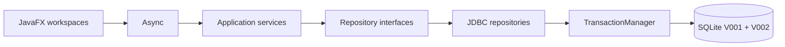
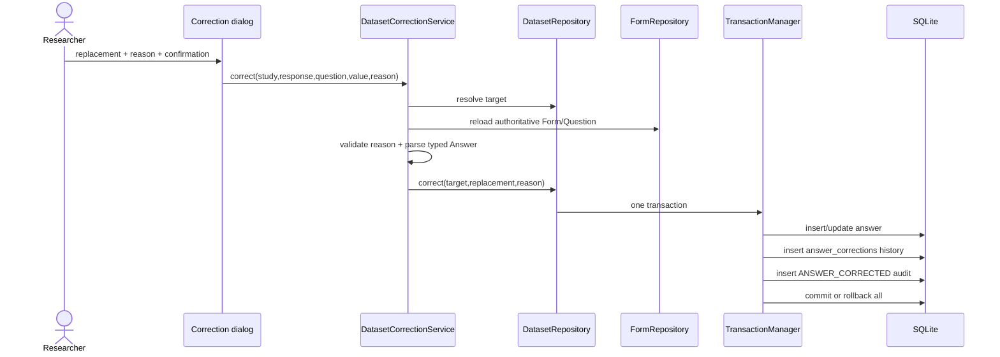

# Current implemented architecture

Date: 2026-09-02  
Implementation baseline: Phase 3 complete

This document describes verified code present now. `../handoffs/PHASE_3_HANDOFF.md` is the current operational
handoff; earlier handoffs are retained as historical phase records.

## 1. Implemented workflow

```text
manage study -> design form -> activate -> collect responses -> inspect/search/filter dataset
             -> open response details -> apply controlled correction -> inspect audit timeline
```

Study, Form, collection, Dataset, correction history, and audit behavior are implemented. Quality
review, dataset snapshots/versions, analysis, AI, findings, and reporting remain later phases.

## 2. Package and dependency boundaries



| Package | Responsibility |
|---|---|
| `app` | Configuration, JavaFX lifecycle, composition root |
| `ui` | Read-only tables, dialogs, navigation, loading/empty/error states |
| `domain` | Immutable entities and dataset projections |
| `state` | Draft/Active/Closed Form behavior |
| `service` | Use cases, typed validation, transaction requests |
| `persistence` | Migrations, JDBC mapping/querying, transactions |
| `util` | Privacy-safe JSON-line logging |

JavaFX contains no SQL. Database work triggered by views runs through `Async`. Services depend on
interfaces, while `AppServices` assembles implementations.

## 3. Domain model

Phase 1–2 entities remain immutable: Study, Form, Section, Question, QuestionOption, Response, and
the sealed typed Answer hierarchy. Question UUID remains the stable dataset variable ID.

Phase 3 projections:

| Type | Purpose |
|---|---|
| `DatasetVariable` | Question ID, form/label/type, range, and option metadata |
| `DatasetCell` | Answer ID, stable Question ID, display value, missing state |
| `DatasetRow` | Response metadata and cells keyed by Question UUID |
| `DatasetPage` | Variables, bounded rows, total count, offset, limit |
| `DatasetQuery` | Search, typed filter, sort, and pagination request |
| `AuditEvent` | Safe audit timeline projection |
| `CorrectionTarget` | Authoritative identifiers resolved before a correction |

Missing answers display as an em dash but remain distinct from empty strings. Multiple-choice
storage is decoded in persistence, not JavaFX.

## 4. Dataset query path

`DatasetService` validates filter/sort requests against authoritative Questions. It rejects invalid
numeric/date filters and question IDs outside the Study. `JdbcDatasetRepository` then executes:

- a count query for stable pagination metadata;
- a response query with a maximum page size of 100 (UI uses 50);
- indexed answer lookups for displayed rows;
- variable metadata queries preserving Question UUIDs and form position.

Supported behavior includes case-insensitive search across response ID, form title, and answer
values; contains/equality/missing filters; numeric/date greater-than and less-than filters; submitted
time/duration/variable sorting; and response details. SQL structure and operators are whitelisted;
values are bound parameters.

## 5. Controlled correction transaction

The dataset table is never directly editable.



The parser is shared with response submission, so corrections cannot bypass question type, numeric
range, choice, yes/no, or date validation. A reason of 3–1,000 characters is mandatory. Audit JSON
contains response ID, Question ID, and reason, but no answer values. Before/after values are retained
only in the local `answer_corrections` data table for traceability.

## 6. Persistence and migrations

`V001__initial_schema.sql` remains unchanged. `V002__dataset_audit_baseline.sql` adds:

- `answer_corrections` with restrictive foreign keys and reason constraints;
- correction lookup indexes;
- response status/submission index;
- audit entity/timestamp index.

`MigrationRunner` registers V001 then V002 and records each once in `schema_migrations`.

Repositories now include:

| Interface | Implementation |
|---|---|
| `StudyRepository` | `JdbcStudyRepository` |
| `FormRepository` | `JdbcFormRepository` |
| `ResponseRepository` | `JdbcResponseRepository` |
| `DatasetRepository`, `AuditRepository` | `JdbcDatasetRepository` |

## 7. JavaFX workspaces

- **Form**: Draft builder, preview, activation, respondent entry, closure.
- **Responses**: persisted response summaries.
- **Dataset**: bounded read-only grid, dynamic stable-variable columns, search, typed filters, sort,
  pagination, response details, confirmed corrections.
- **Audit timeline**: newest 250 Study events with actor/entity/timestamp, without answer contents.

Dataset is enabled in `Navigator`; Quality/Versions onward remain disabled.

The idempotent development seed now adds a four-question active survey and eight responses to the
standard development Study when it has no forms. Existing user-created databases are not populated.

## 8. Patterns actually implemented

Repository, Service Layer, State, Transaction Manager, Dependency Injection/Composition Root, Error
Boundary, immutable domain projections, and Simple Factory are implemented. The correction workflow
is a controlled command-style use case but does not yet introduce the Phase 4 reversible `Command`
interface. Strategy, Chain of Responsibility, Adapter, and Analysis Facade remain future work.

## 9. Verification baseline

The 13-test suite covers migrations and foreign keys; generic rollback; Study/Form persistence and
State behavior; transactional submissions; bounded dataset queries; search; numeric filters;
variable sorting; details; correction validation/persistence; privacy-safe audit details; and forced
correction-audit rollback.

```text
Tests run: 13, Failures: 0, Errors: 0, Skipped: 0
BUILD SUCCESS
```

## 10. Current boundaries

- Dataset pages are bounded but use simple offset pagination, appropriate for the planned 100–300
  record demonstration dataset.
- Corrections retain local history but do not create dataset versions; Phase 4 adds snapshots and
  safe version restore.
- Quality flags do not exist yet and no correction occurs automatically.
- Response exclusion is represented in schema but not exposed until quality review.
- There is no JavaFX UI automation suite; behavior is tested at service/persistence boundaries.
- Actor names remain local placeholders until identity requirements are defined.
