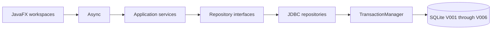
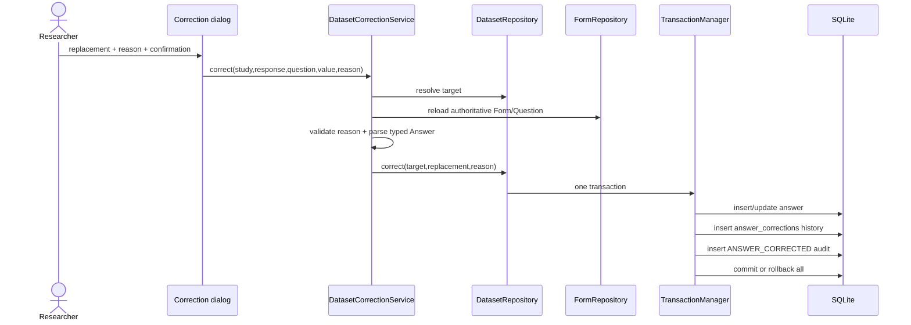

# Current implemented architecture

Date: 2026-09-09

Implementation baseline: Phase 7 plus P1 integrity and P2 reliability fixes

This document describes verified code present now. `../handoffs/PHASE_7_HANDOFF.md` is the current operational
handoff; earlier handoffs are retained as historical phase records.

The [P1 integrity implementation report](../INTEGRITY_IMPLEMENTATION_REPORT.md) documents the
subsequent V005 migration and regression verification. Service writes now use `StudyWriteGuard`;
JDBC mutations also check archive state inside their transaction. New snapshots record response
membership independently of answers. Legacy snapshots remain readable with incomplete-membership
warnings, and exact restore of those legacy versions is rejected. `VersionService.freshness` exposes
live-versus-active equality without creating versions. Default-active analysis warns on stale data.

## 1. Implemented workflow

P2 adds an application-level `DatabaseRecoveryService` using SQLite online backup and validated staged recovery,
an operation gate in `ConnectionFactory`, disposable `Async` workspace scopes, explicit partial import receipts,
and atomic report-file publication with a separate audit result. V006 saves analysis evidence schema and original
variable labels; `EvidenceDecoder` reconstructs historical evidence without rerunning statistics. Reports distinguish
live summaries and historical finding provenance. See the [P2 report](../P2_RELIABILITY_IMPLEMENTATION_REPORT.md)
for 13 additional tests, the 132-test clean Wrapper build, packaging verification, and remaining manual checks.

```text
manage study -> design form -> activate -> collect responses -> inspect/search/filter dataset
             -> open response details -> apply controlled correction -> inspect audit timeline
             -> scan for quality issues -> review (correct/exclude/accept/defer)
             -> create dataset version snapshot -> restore an earlier version if needed
             -> run a manual analysis bound to an explicit dataset version -> inspect evidence
             -> ask a natural-language question -> validated plan -> evidence -> plain explanation
             -> (or) import an external CSV file as a new form and responses -> same pipeline
             -> create a finding (+ chart) from evidence -> approve -> compose/export the report
```

Study, Form, collection, Dataset, correction history, audit, quality review, dataset versioning,
deterministic manual analysis, local-AI "Ask Your Data", CSV dataset import, and
visualization/findings/reporting are implemented. This completes the roadmap's core phased scope
(Phase 8 is release hardening, not new functionality).

## 2. Package and dependency boundaries



| Package | Responsibility |
|---|---|
| `app` | Configuration, JavaFX lifecycle, composition root |
| `ui` | Read-only tables, dialogs, navigation, loading/empty/error states |
| `domain` | Immutable entities, dataset/quality/version/analysis projections |
| `state` | Draft/Active/Closed Form behavior |
| `service` | Use cases, typed validation, transaction requests |
| `persistence` | Migrations, JDBC mapping/querying, transactions |
| `quality` | Deterministic quality-handler chain |
| `command` | Explicit review-action Command hierarchy |
| `analysis` | Strategies, plan validator, warnings, shared statistics |
| `ai` | LLM client/adapter, prompts, defensive plan parser |
| `dataimport` | CSV parsing, column type inference, variable-key sanitization |
| `visualization` | Chart selection/building from structured results, JavaFX and inline-SVG rendering |
| `report` | Report HTML composition |
| `util` | Privacy-safe JSON-line logging |

JavaFX contains no SQL. Database work triggered by views runs through `Async`. Services depend on
interfaces, while `AppServices` assembles implementations.

## 3. Domain model

Phase 1–2 entities remain immutable: Study, Form, Section, Question, QuestionOption, Response, and
the sealed typed Answer hierarchy. Question UUID remains the stable dataset variable ID.

Phase 3 projections:

| Type | Purpose |
|---|---|
| `DatasetVariable` | Question ID, form/label/type, range, and option metadata |
| `DatasetCell` | Answer ID, stable Question ID, display value, missing state |
| `DatasetRow` | Response metadata and cells keyed by Question UUID |
| `DatasetPage` | Variables, bounded rows, total count, offset, limit |
| `DatasetQuery` | Search, typed filter, sort, and pagination request |
| `AuditEvent` | Safe audit timeline projection |
| `CorrectionTarget` | Authoritative identifiers resolved before a correction |

Missing answers display as an em dash but remain distinct from empty strings. Multiple-choice
storage is decoded in persistence, not JavaFX.

Phase 4 projections:

| Type | Purpose |
|---|---|
| `QualityIssue` | Type, severity, status, affected response/question, explanation, resolution note |
| `QualityIssueType`, `QualitySeverity`, `QualityIssueStatus` | Enums matching the `quality_issues` CHECK constraints |
| `DatasetVersion` | Study, parent version, version number, reason, change summary, active flag |

Phase 5 projections:

| Type | Purpose |
|---|---|
| `AnalysisMethod` | The five reduced-MVP methods |
| `AnalysisFilter`, `AnalysisPlan` | A structured, schema-validated analysis request bound to an explicit (or "active") dataset version |
| `AnalysisResult` | Sealed result per method: `Frequency`, `NumericSummary`, `Correlation`, `CrossTabulation`, `GroupComparison` |
| `EvidenceBundle` | Persisted analysis id, method, variables, filters, sample size, result, warnings, and version — everything a claim must expose |
| `VersionAnswer` | One reconstructed typed `Answer` from a version snapshot row, or missing |
| `AnalysisSummary`, `StoredAnalysis` | History-list row and raw-JSON details projections |

Phase 6 projections:

| Type | Purpose |
|---|---|
| `ChatRole`, `ChatMessage` | One "Ask Your Data" turn, optionally linked to the analysis it produced |
| `ModelMetadata` | Model, runtime, and prompt-template version stored with an AI-sourced analysis |
| `AiAnswer` | The computed `EvidenceBundle` plus its plain-language explanation, returned by `AnalysisFacade.ask` |

Phase 7 projections:

| Type | Purpose |
|---|---|
| `FindingStatus`, `Finding` | A researcher-reviewed statement bound permanently to one analysis/version, with an optional chart |
| `ReportDocument` (+ `QualitySummary`) | A fresh, never-persisted composition of Study/quality/version/finding data for one report |
| `visualization.ChartSpec` | Sealed `Bar`/`Histogram`/`Scatter` — every variant a flat list of primitives |

## 4. Dataset query path

`DatasetService` validates filter/sort requests against authoritative Questions. It rejects invalid
numeric/date filters and question IDs outside the Study. `JdbcDatasetRepository` then executes:

- a count query for stable pagination metadata;
- a response query with a maximum page size of 100 (UI uses 50);
- indexed answer lookups for displayed rows;
- variable metadata queries preserving Question UUIDs and form position.

Supported behavior includes case-insensitive search across response ID, form title, and answer
values; contains/equality/missing filters; numeric/date greater-than and less-than filters; submitted
time/duration/variable sorting; and response details. SQL structure and operators are whitelisted;
values are bound parameters.

## 5. Controlled correction transaction

The dataset table is never directly editable.



The parser is shared with response submission, so corrections cannot bypass question type, numeric
range, choice, yes/no, or date validation. A reason of 3–1,000 characters is mandatory. Audit JSON
contains response ID, Question ID, and reason, but no answer values. Before/after values are retained
only in the local `answer_corrections` data table for traceability.

## 6. Quality review (Chain of Responsibility + Command)

`QualityService.scan` loads authoritative Forms and full typed Responses, then runs the
`QualityHandler` chain (`MissingRequiredHandler` → `InvalidRangeHandler` → `DuplicateResponseHandler`
→ `OutlierHandler` → `FastSubmissionHandler`); every handler always runs and contributes its own
issues. Detected issues are reconciled — not blindly inserted — against currently active
(OPEN/ACCEPTED/DEFERRED) issues by a `(type, response, question)` fingerprint, so a still-open
condition is never duplicated on repeated scans.

A researcher decision is an explicit `ReviewCommand` (`Correct`, `Exclude`, `Accept`, `Defer`),
interpreted only by `QualityReviewService`. `Correct` first validates target ownership and prepares a typed replacement through
`DatasetCorrectionService`; `QualityRepository.correctAndResolve` then updates the answer, correction
history, issue status, and both audit events in one transaction on one connection. `Exclude`, `Accept`, and `Defer` each update
`quality_issues` and write an audit event in one transaction. No command deletes data; `Exclude` only
sets the schema's `EXCLUDED` response status.

## 7. Dataset versioning

`VersionRepository.createSnapshot` captures all live responses (including zero-answer responses) in
`version_response_snapshots`, and all present answers in `version_answer_snapshots`. Exclusion state
is recorded independently of answer presence. New versions carry `membership_complete=1`.

Restore resets live presence using `responses.in_dataset` and `answers.is_present`, restores target
membership/statuses and values, then creates a new active version in the same transaction. Physical
rows remain for correction-history references and later-version recovery. Earlier snapshots remain
unchanged. Legacy V001?V004 versions have only provable membership backfilled and are marked incomplete;
they remain readable but exact restore is rejected because historical blank membership is unknown.

`VersionService.freshness` reports no active version, current, stale, or unknown legacy membership.
It compares live members/statuses/present answers with the active snapshot and does not create a
version. Default-active analyses warn if live data differs; historical legacy analyses warn about
incomplete population information.

## 8. Deterministic analysis (Strategy + Simple Factory)

`AnalysisService.run` is the manual analysis facade: `AnalysisPlanValidator` checks variable
existence, method/type compatibility, and filter validity against authoritative Question metadata
before anything executes; the plan's dataset version is then resolved (explicit, or the Study's
active version, auto-creating a baseline snapshot if none exists); `AnalysisRepository.loadVersionData`
reconstructs every typed `Answer` from that version's **immutable snapshot** (never the live
`answers` table); `AnalysisData` groups/filters the result; and the method's `AnalysisStrategy`
(`FrequencyStrategy`, `NumericSummaryStrategy`, `CorrelationStrategy`, `CrossTabulationStrategy`,
`GroupComparisonStrategy`, chosen via `AnalysisStrategyRegistry`) computes a typed `AnalysisResult`.
`AnalysisWarnings` adds small-sample/heavy-missingness/non-causal notes, and the resulting
`EvidenceBundle` is persisted alongside the plan/result JSON and an `ANALYSIS_RUN` audit event.

Because analysis reads a frozen version snapshot rather than live data, re-running the same stored
plan against the same version reproduces its original result even after later corrections —
verified directly by `JdbcAnalysisRepositoryTest`. All statistics (mean, median, sample standard
deviation, Pearson correlation, Welch's t-statistic/degrees of freedom, Cohen's d) are textbook
arithmetic in `analysis.Statistics`, with no external math dependency and no reported p-value (see
`PHASE_5_HANDOFF.md` for why).

## 9. Local AI and "Ask Your Data" (Adapter)

`LlmClient` is the adapter boundary: `isAvailable()` (health check), `modelIdentifier()`, and
`complete(systemPrompt, userPrompt)`, which throws a categorized `LlmException`
(`UNAVAILABLE` / `TIMEOUT` / `MALFORMED_RESPONSE`) rather than ever returning a partial or
fabricated result. `LocalLlmClient` targets a local Ollama-compatible `/api/generate` endpoint over
plain `java.net.http.HttpClient` (no new Maven dependency); `DisabledLlmClient` is a no-op used when
AI is turned off in `AppConfig`.

`AnalysisFacade.ask` is the only orchestrator: build a versioned plan-generation prompt from every
Question's ID/label/type/options (`AiPromptBuilder.planPrompt`) -> `LlmClient.complete` -> defensively
parse the raw text into an `AnalysisPlan` (`AnalysisPlanParser`, rejecting bad JSON/method/variable/
filter shapes) -> **the exact same `AnalysisPlanValidator` and `AnalysisService.run` manual analysis
uses** -> persist the resulting evidence with `source='AI'` and a `ModelMetadata` JSON blob -> build
an evidence-only explanation prompt (`AiPromptBuilder.explanationPrompt`) -> `LlmClient.complete`
again -> persist both turns to `chat_references`, linked via `analysis_id`. A structurally valid but
semantically unsupported plan (wrong variable type, duplicate variables) is rejected by the
validator exactly as it would be from the manual UI; an explanation-call failure falls back to a
plain message without touching the already-persisted evidence.

## 10. Visualization, findings, and reporting (Facade)

`ChartBuilder.build(evidence, primaryValues, secondaryValues)` chooses and builds a `ChartSpec`
directly from an already-computed `AnalysisResult` — frequency → bar, numeric summary → histogram,
correlation → scatter, cross-tabulation/group comparison → a flattened/two-bar chart. Histogram and
scatter need raw values behind the aggregated statistics; `AnalysisService.chartValues` re-derives
them from the *same immutable dataset-version snapshot* the analysis itself used, so a chart can
never silently diverge from the version it illustrates. `ui.ChartView` renders a `ChartSpec` with
native JavaFX chart controls (in-app); `visualization.SvgChartRenderer` renders the same spec as a
small inline SVG string (HTML report export) — two renderers, one shared, tested source of truth.

`FindingService.draft` creates a `Finding` from a fresh `EvidenceBundle` (plus its chart, if one
could be derived) with `analysisId`/`datasetVersionId` fixed permanently; `edit` preserves the evidence link but records the previous wording and returns changed approved
findings to Draft, clearing approval time until explicit reapproval. `ReportService.compose` is a **fresh composition on every call** — Study metadata, form/
response counts, a quality-status breakdown, only **approved** findings, and deterministic
limitations — never persisted itself, so a report can never drift from what the tables currently
say. `ReportService.export` writes `ReportHtmlRenderer`'s self-contained HTML (charts as inline
SVG, no external assets) and records a `REPORT_GENERATED` audit event.

A finding's chart is serialized once, at creation time, into `findings.chart_json` — a shape this
phase fully controls (every `ChartSpec` variant is a flat list of primitives) — rather than being
re-derived later from the richer, five-shaped `analyses.result_json` (which Phase 5 deliberately
never built a reader for). This is how a report's charts survive an application restart without a
general-purpose JSON parser.

## 11. Persistence and migrations

`V001__initial_schema.sql` remains unchanged and already defines `quality_issues`, `dataset_versions`,
`version_answer_snapshots`, `analyses` (including `model_metadata_json`), `chat_references`, and
`findings` — all with columns unchanged since Phase 1 except where noted below.
`V002__dataset_audit_baseline.sql` adds:

- `answer_corrections` with restrictive foreign keys and reason constraints;
- correction lookup indexes;
- response status/submission index;
- audit entity/timestamp index.

`V003__quality_review_indexes.sql` adds `quality_issues(response_id)`, `quality_issues(question_id)`,
and `version_answer_snapshots(response_id)` indexes. `V004__finding_evidence_columns.sql` adds two
nullable columns, `findings.evidence_summary` and `findings.chart_json`.

`MigrationRunner` registers V001 through V006, recording each once in `schema_migrations`. Neither
Phase 5 nor Phase 6 required a new migration. V005 adds independent response snapshots, live
response/answer presence flags, membership-completeness metadata, and finding wording revisions.
Old migration files remain unchanged.

Repositories now include:

| Interface | Implementation |
|---|---|
| `StudyRepository` | `JdbcStudyRepository` |
| `FormRepository` | `JdbcFormRepository` |
| `ResponseRepository` | `JdbcResponseRepository` |
| `DatasetRepository`, `AuditRepository` | `JdbcDatasetRepository` |
| `QualityRepository` | `JdbcQualityRepository` |
| `VersionRepository` | `JdbcVersionRepository` |
| `AnalysisRepository` | `JdbcAnalysisRepository` |
| `ChatRepository` | `JdbcChatRepository` |
| `FindingRepository` | `JdbcFindingRepository` |

`SnapshotJson` (extracted from `JdbcVersionRepository` in Phase 5) is the one shared codec for the
small JSON shape stored in `version_answer_snapshots.value_json`, used by both version restore and
analysis reads. `SimpleJson` (in `ai`, package-private) is a separate, smaller extractor for the flat
JSON shapes exchanged with the LLM. `JdbcFindingRepository` owns a third, self-contained `chart_json`
codec — three deliberately distinct, narrow tools for three different stored JSON shapes, none of
them a general-purpose parser.

`AuditRepository` gained a `recordEvent` write method (implemented by `JdbcDatasetRepository`,
exposed via `AuditService.record`) for the one place a service needed to write a standalone audit
event outside another repository's own transaction: report export.

## 12. JavaFX workspaces

- **Form**: Draft builder, preview, activation, respondent entry, closure.
- **Responses**: persisted response summaries.
- **Dataset**: bounded read-only grid, dynamic stable-variable columns, search, typed filters, sort,
  pagination, response details, confirmed corrections.
- **Audit timeline**: newest 250 Study events with actor/entity/timestamp, without answer contents.
- **Quality / Versions**: an Issues tab (scan, status filter, single/bulk review actions with
  confirmation and affected counts) and a Versions tab (create snapshot, restore).
- **Analysis**: a Run tab (method/variable/filter/version plan builder and evidence panel), an Ask
  Your Data tab (natural-language question, transcript, and the same evidence rendering), and a
  History tab (past analyses with a raw plan/result/warnings details view).
- **Import**: choose a CSV file, review/edit the proposed column plan (label, type, required,
  included), then import — creating a new active Form and its Responses through the exact same
  `FormService`/`ResponseSubmissionService` path a manually built form would use. A bad row is
  skipped and reported rather than aborting the whole file.
- **Findings / Report**: a Findings tab (status filter, review dialog: edit wording, approve,
  reject, with a chart preview when present) and a Report tab (native JavaFX preview + "Export
  HTML…" via a save `FileChooser`).

Every workspace — Dataset, Quality/Versions, Analysis (including Ask Your Data), Import, and
Findings/Report — is enabled in `Navigator`.

The idempotent development seed adds a four-question active survey and eight responses to the
standard development Study when it has no forms — including one duplicate pair, one statistical
outlier, and one unusually fast submission, all detected by the Phase 4 quality handlers. Existing
user-created databases are not populated.

## 13. Patterns actually implemented

Creational patterns include Builder (`AnalysisPlan.Builder`) and Simple Factory
(`LlmClientFactory`, plus the default strategy registry assembly). Behavioural patterns include
Strategy (`AnalysisStrategy`, with injectable and validated registration), State (`FormState`),
Chain of Responsibility (`QualityHandler`), and the existing quality review commands
(`ReviewCommand`, interpreted by `QualityReviewService`). Structural patterns include Adapter
(`LocalLlmClient` behind `LlmClient`) and Facade (`AnalysisFacade` for AI,
`AnalysisPresentationFacade` for dashboard/history evidence and charts, and `ReportService`
for report composition). `DisabledLlmClient` is a disabled / Null Object implementation;
`ChartBuilder` uses static typed dispatch, not a separate Strategy interface.

Repository, Service Layer, Transaction Manager, Dependency Injection/Composition Root, Error
Boundary, and immutable domain projections also remain architectural idioms in use.
See [Design patterns: implementation and rationale](DESIGN_PATTERNS.md) for the refactoring,
class responsibilities, examples, diagrams, extension boundaries, and verification.

## 14. Verification baseline

The 132-test suite covers migrations and foreign keys; generic rollback; Study/Form persistence and
State behavior; transactional submissions; bounded dataset queries; search; numeric filters;
variable sorting; details; correction validation/persistence; privacy-safe audit details; forced
correction-audit rollback; each quality handler's detection rule and chain composition; scan
reconciliation/dedup and review-action transactions/audit; version snapshot content and restore
without rewriting history; the seeded study's embedded quality examples; hand-verified statistics;
each analysis strategy's output and edge cases; plan validation per method; the full
run/persist/history round trip including reproducibility against a fixed dataset version; defensive
AI-plan parsing (well-formed, fenced/prose-wrapped, and every rejection path); prompt content; the
full "Ask Your Data" facade — five representative questions across all five methods, malformed/
hallucinated plans never executing, manual analysis working with AI unavailable, and a graceful
explanation-failure fallback — all against a `FakeLlmClient`, never a real network call; CSV parsing
(quoting, embedded commas/newlines, CRLF, blank lines); column type inference and variable-key
sanitization/deduplication; a full import round trip (valid rows imported, invalid rows skipped and
reported, the result immediately queryable through the Dataset workspace); chart selection/content
per method including the histogram/scatter raw-value requirement; SVG rendering and HTML escaping;
the finding create/edit/approve/reject lifecycle including the chart JSON round trip and that the
analysis/version link survives a wording edit; and report composition (approved-only findings) plus
HTML export with its audit event.

```text
Tests run: 132, Failures: 0, Errors: 0, Skipped: 0
BUILD SUCCESS
```

The final integrity verification used `mvn -o "-Dmaven.repo.local=D:\research_flow\.tools\m2" clean test`.
Twenty added tests cover exact restore/rollback, blank populations, approval invalidation/revisions,
quality correction rollback including final-audit failure, mismatched targets, 23 archived write paths,
freshness, and V004 upgrade/rollback behavior. See the implementation report for the full test inventory.

## 15. Current boundaries

- Dataset pages are bounded but use simple offset pagination, appropriate for the planned 100–300
  record demonstration dataset.
- Quality issue explanations avoid literal answer values by design, referencing variable labels and
  computed ranges instead.
- Dataset versions are Study-wide snapshots of every answer, not a per-variable diff; this is
  appropriate at the planned 100–300-record scale but would need revisiting at larger scale.
- The two-group comparison reports Welch's t-statistic, its degrees of freedom, and Cohen's d, but
  intentionally no p-value (would require an incomplete-beta special function; see the Phase 5
  handoff for the trade-off).
- Analysis history shows raw stored plan/result/warnings JSON rather than a fully reconstructed
  typed `EvidenceBundle`; the freshly computed evidence is shown in full immediately after a run.
- `LocalLlmClient` targets one local Ollama-compatible HTTP shape; swapping runtimes means adjusting
  its endpoints/request body, not the `LlmClient` contract it implements.
- There is no separate mid-flight "Cancel" button for an AI request; cancellation relies on ordinary
  executor/thread interruption (already wired through `ResearchFlowApplication.stop()`).
- CSV import infers only SHORT_TEXT/NUMBER/DATE (no choice/option or Likert/rating inference), never
  sets a numeric minimum/maximum, and always creates a brand-new Form rather than appending to an
  existing one; only the first 25 per-row errors are reported for a very messy file.
- Grouped-bar and box-plot charts are optional per the reduced-MVP chart set and are not
  implemented; cross-tabulation and group comparison instead flatten into a `Bar`.
- A historical `analyses.result_json` still has no general reader (by design, see Phase 5); a
  finding's chart is only ever built once, at creation time, from the fresh evidence in memory.
- The Report tab's in-app preview uses native JavaFX controls, not the exported HTML/SVG directly
  (no `javafx-web`/WebView dependency); the exported file is the authoritative rendering.
- There is no JavaFX UI automation suite; behavior is tested at service/persistence boundaries.
- Actor names remain local placeholders until identity requirements are defined.
