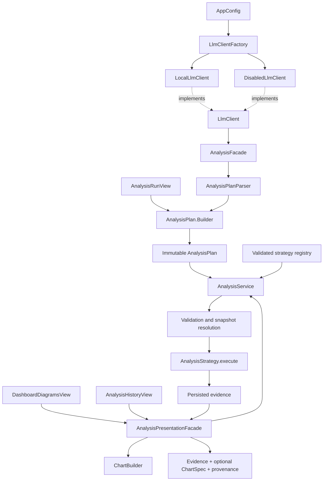
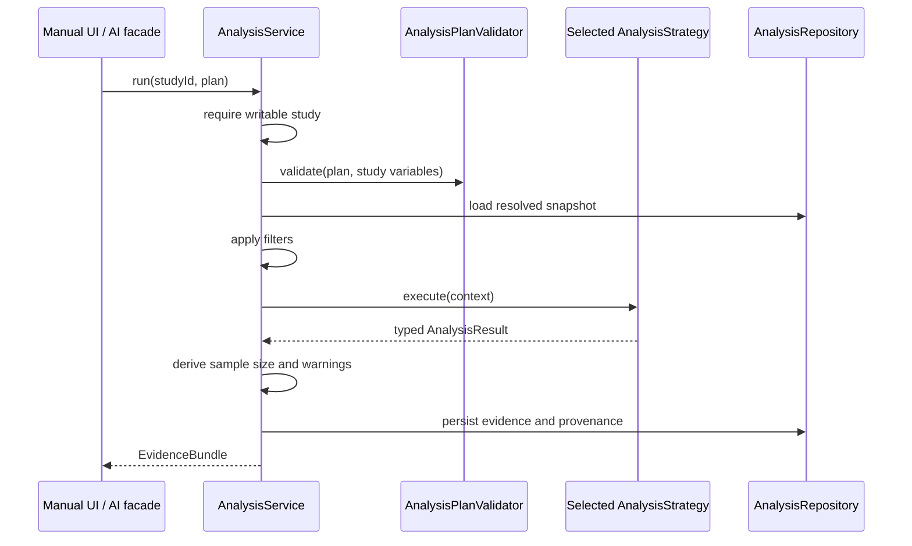

# Design patterns in ResearchFlow

This document explains the creational, behavioural, and structural patterns used in the running application. It distinguishes the changes in this refactoring from patterns that already existed. Paths below are relative to the repository root; the examples use the implemented APIs.

## 1. What changed

| Category | Pattern | Implementation | Change and purpose |
| --- | --- | --- | --- |
| Creational | Builder | `AnalysisPlan.Builder` | Added named construction of immutable analysis requests; adopted by manual analysis and AI plan parsing. |
| Creational | Simple Factory | `app.LlmClientFactory` | Extracted AI-client selection from application wiring so configuration has one construction policy. |
| Behavioural | Strategy | `AnalysisStrategy`, its five implementations, `AnalysisStrategyRegistry`, `AnalysisService` | Strengthened the existing pattern with constructor injection and fail-fast registration. |
| Structural | Facade | `AnalysisPresentationFacade` | Added one operation to load historical evidence, the matching chart, and provenance; adopted by dashboard diagrams and analysis history. |
| Behavioural | State | `FormState`, `DraftFormState`, `ActiveFormState`, `ClosedFormState` | Existing; retained for form lifecycle rules. |
| Behavioural | Chain of Responsibility | `QualityHandler`, `QualityHandlerChain` and handlers | Existing; retained for sequential quality checks. |
| Structural | Adapter | `LlmClient`, `LocalLlmClient` | Existing; retained to isolate the Ollama-compatible HTTP protocol. |
| Structural | Facade | `AnalysisFacade`, `ReportService` | Existing; retained for AI orchestration and report composition. |

A Simple Factory is a useful creational idiom, but it is **not** the GoF Factory Method pattern: it selects implementations directly instead of delegating creation to subclasses. The Builder is the explicit GoF creational example added here. `DisabledLlmClient` acts as a disabled implementation / Null Object; it does not adapt an external protocol. `ChartBuilder` uses static per-result dispatch, rather than an interchangeable Strategy interface.

## 2. How the pieces fit together



Application construction stays in `AppServices`. No global singleton, service locator, reflection-based plugin discovery, or dependency-injection framework was introduced. Views continue to run database work through `Async` and render JavaFX nodes on the UI thread.

## 3. Creational: analysis-plan Builder

### Problem

An analysis plan has a method and primary variable plus optional secondary variable, filters, and dataset version. Positional calls containing several UUIDs and nulls were difficult to review:

```java
new AnalysisPlan(method, primaryId, secondaryId, filters, versionId);
```

### Implementation

[`AnalysisPlan.java`](../../src/main/java/researchflow/domain/AnalysisPlan.java) contains a nested mutable `Builder` that produces immutable `AnalysisPlan` records:

```java
var plan = AnalysisPlan.builder(AnalysisMethod.CORRELATION, sleepId)
        .secondaryVariable(focusId)
        .filters(filters)
        .datasetVersion(snapshotId)
        .build();
```

For a simple frequency analysis:

```java
var plan = AnalysisPlan.builder(AnalysisMethod.FREQUENCY, preferenceId).build();
```

- Method and primary variable are required when starting a builder.
- Secondary variable and dataset version default to null; filters default to an empty list.
- A null dataset version preserves the existing active-snapshot / baseline policy.
- Filters are copied when configured and in the resulting record. Changing a source list or reusing a builder cannot mutate a previously built plan.
- The builder handles construction, not statistical or study-specific validation. `AnalysisPlanValidator` still validates variable ownership, variable types, method requirements, and filters before execution.
- The original record constructor remains available for persistence, existing integrations, and tests of invalid plans.

**Actual callers:** `AnalysisRunView.run()` and `AnalysisPlanParser.parse()`. Thus both manual and AI-generated requests use the same named construction style.

**Tradeoff:** A builder adds a small class. It is useful for this multi-option request; it should not be added automatically to every small domain record. Builders should be local to one operation, not shared across threads.

## 4. Creational: AI-client Simple Factory

[`LlmClientFactory.java`](../../src/main/java/researchflow/app/LlmClientFactory.java) owns configuration-based client selection:

```java
LlmClient client = LlmClientFactory.create(config);
```

`AppServices.initialize()` now calls the factory instead of directly selecting and constructing concrete AI clients.

| Configuration | Constructed client |
| --- | --- |
| AI enabled | `LocalLlmClient` with the configured endpoint, model, and timeout |
| AI disabled | `DisabledLlmClient` |

Construction does not contact the runtime or download models. Availability checks and HTTP execution remain adapter responsibilities. Each call creates a new client; there is no process-global cached instance. The factory lives in the `app` package because it interprets application configuration, keeping the AI protocol package independent of application wiring.

**Extension example:** If a second supported runtime is added, introduce its `LlmClient` adapter and extend validated application configuration and this selection policy. Callers of `LlmClient` should not need provider-specific branches. This refactoring does not itself add another runtime.

## 5. Behavioural: injectable statistical strategies

The existing [`AnalysisStrategy`](../../src/main/java/researchflow/analysis/AnalysisStrategy.java) interface defines `method()` and `execute(AnalysisContext)`. The concrete strategies implement frequency, numeric summary, correlation, cross-tabulation, and group comparison.

Before this change, `AnalysisService` constructed its own fixed default map. It now also accepts a collection of strategies through an overloaded constructor:

```java
var service = new AnalysisService(forms, versions, analyses, writeGuard, implementations);
```

The original four-argument constructor still supplies the normal defaults, so application behaviour remains the same. Both constructors use [`AnalysisStrategyRegistry.register()`](../../src/main/java/researchflow/analysis/AnalysisStrategyRegistry.java), which:

1. Indexes strategies by `AnalysisMethod` in an enum map.
2. Rejects null strategies or null method identities.
3. Rejects duplicate registrations instead of silently replacing one.
4. Requires an implementation for every supported method.
5. Returns an immutable map, preventing mid-request changes to dispatch.

`AnalysisService` remains the Strategy **context**. Strategies receive validated, filtered data; they do not own the persistence workflow:



**Why this matters:** Tests or a future composition profile can substitute an implementation without editing `AnalysisService`, while retaining the common validation and persistence path. Strategy injection is trusted application composition, not a user-facing facility for executing arbitrary algorithms.

**Extension boundary:** Replacing an algorithm for an existing method only needs a complete alternative strategy collection. Adding a new method also requires updates to `AnalysisMethod`, plan validation, result serialization/decoding, chart/report handling, and AI prompts. Strategy does not remove those domain contracts.

## 6. Structural: analysis-presentation Facade

### Problem

Dashboard diagrams and analysis history repeated the sequence of reopening evidence, reading raw values, building a chart, and obtaining provenance. History also used an untyped `Object[]` result and a second asynchronous chart callback.

### Implementation

[`AnalysisPresentationFacade.java`](../../src/main/java/researchflow/service/AnalysisPresentationFacade.java) exposes one read operation:

```java
var presentation = new AnalysisPresentationFacade(analysisService)
        .load(studyId, analysisId);

var historical = presentation.historical();
var optionalChart = presentation.chart();
var provenance = presentation.provenance();
```

The typed `Presentation` record contains historical evidence, `Optional<ChartSpec>`, and provenance text. The facade:

1. Reopens the stored analysis through `AnalysisService`, checking study ownership first.
2. For supported evidence, reads snapshot-bound numeric values only when a histogram or scatter plot needs them.
3. Builds frequency, cross-tabulation, and group-comparison charts directly from stored aggregate results.
4. Obtains provenance without creating another analysis or modifying responses.
5. Returns unsupported historical evidence with no chart so the UI can retain its existing notice/raw-evidence handling.

The dashboard and history now use this operation from their worker tasks. JavaFX rendering remains in `ChartView`; the facade returns data, never scene-graph controls. An empty chart can also mean there are no values to plot. Database/decoding failures still propagate to the caller's existing error handling.

**Why Facade:** This is a simplified entry point over several subsystem operations. It is not an Adapter because it is not translating an external protocol, and it is not a new persistence layer. The existing `AnalysisFacade` has a different purpose: orchestrating conversational AI and statistical execution.

**Tradeoff:** History loads the chart specification before showing its dialog instead of showing the dialog first and adding a chart later. The operation remains asynchronous, but a large scatter dataset can delay dialog opening. Charts still use the existing chart builder and rendering rules; this change does not introduce sampling or new statistical methods.

## 7. Existing patterns retained

### State — form lifecycle

`FormState.forStatus()` selects `DraftFormState`, `ActiveFormState`, or `ClosedFormState`. Their operations express permitted structural edits, submissions, activation, and closure. This is suitable because behaviour changes with a form's lifecycle, rather than with an independently selected statistical algorithm. See `FormService`, `ResponseSubmissionService`, and `FormStateTest` for the integration and rules.

### Chain of Responsibility — quality checks

`QualityHandlerChain.buildDefault()` links missing-required, invalid-range, duplicate-response, outlier, and fast-submission handlers. Each handler contributes issues and forwards evaluation along the chain. This is an accumulating variant of the pattern: a detected issue does not stop the remaining checks. `QualityService` uses the chain; individual check logic remains separated and independently testable.

### Adapter — local AI protocol

`LocalLlmClient` translates `LlmClient.complete(systemPrompt, userPrompt)` into the local runtime's HTTP request/response shape and maps transport failures to `LlmException`. The application does not need HTTP details in its chat or analysis views. The new factory chooses this adapter; the factory and adapter have different responsibilities.

### Other architectural idioms

Repository interfaces separate service operations from JDBC persistence. `AppServices` is a composition root. These support the design but should not be presented as newly implemented GoF patterns. The quality-review command records and existing report/AI facades remain unchanged by this refactoring.

## 8. Verification

Verified on 2026-09-10: **160 tests, 0 failures, 0 errors, 0 skipped; BUILD SUCCESS** using the full offline Maven test command below.

| Test | What it establishes |
| --- | --- |
| `AnalysisPlanBuilderTest` | Named/default construction matches the record contract; filter copying and builder reuse preserve immutability. |
| `LlmClientFactoryTest` | Enabled/disabled configuration selects the expected client; a local adapter can be constructed without a working runtime. |
| `AnalysisStrategyRegistryTest` | Default coverage, immutable registration, duplicate rejection, and missing-method rejection. |
| `JdbcAnalysisRepositoryTest.injectedStrategyExecutesOnlyAfterTheSharedValidationPipeline` | An injected numeric strategy runs for valid input; invalid variable types are rejected before its execution. |
| `JdbcAnalysisRepositoryTest.presentationFacadeLoadsSavedChartAndRejectsAnotherStudy` | Presentation remains tied to the saved snapshot after a live correction; cross-study access is rejected. |
| `DashboardDiagramsInteractionTest` | The actual dashboard controls load/refresh diagrams while retaining saved-snapshot chart counts. |
| Existing parser, facade, strategy, State, quality-chain, persistence, and chart tests | The surrounding workflows retain their established behaviour. |

Run the suite with `mvn test`. For the repository's bundled Windows Maven and cached dependencies:

```powershell
.\.tools\maven\apache-maven-3.9.16\bin\mvn.cmd -o "-Dmaven.repo.local=.tools/m2" test
```

The AI tests use test doubles or local HTTP test servers; passing them does not establish the answer quality of an installed model. No database migration is needed for this refactoring.

## 9. Choices deliberately left out

- No Singleton for services or database connections: constructor injection and explicit lifecycle management already provide ownership.
- No Abstract Factory hierarchy: there are no interchangeable families of related infrastructure products that need one.
- No general event bus or Observer layer: the affected screens already have explicit JavaFX/Async lifecycles.
- No class per chart branch solely to increase the pattern count: the existing typed chart dispatch remains small.
- No behavioural changes to statistical formulas, persistence formats, study write guards, or AI evidence restrictions were required.

Patterns are used at the construction, algorithm-selection, and subsystem-access boundaries where they solve concrete maintenance problems.
