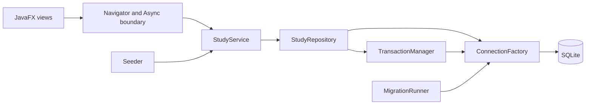

# Phase 1 component diagram

```mermaid
flowchart LR
    FX[JavaFX views] --> NAV[Navigator and Async boundary]
    NAV --> SS[StudyService]
    SS --> SR[StudyRepository]
    SR --> TX[TransactionManager]
    SR --> CF[ConnectionFactory]
    TX --> CF
    CF --> DB[(SQLite)]
    MR[MigrationRunner] --> CF
    SEED[Seeder] --> SS
```

Dependency direction is UI -> service/domain -> repository/persistence. JavaFX views contain no SQL,
and persistence code contains no JavaFX types.
