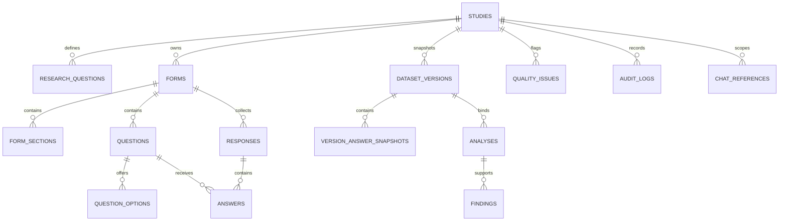

# Phase 1 database model

The initial migration creates the whole lifecycle skeleton so later phases add behavior without
renaming core identifiers or rebuilding foreign-key relationships.

IDs are application-generated UUID strings. Times are ISO-8601 UTC strings; dates are ISO local
dates. Status columns use database `CHECK` constraints as a second line of defense after domain
validation.
