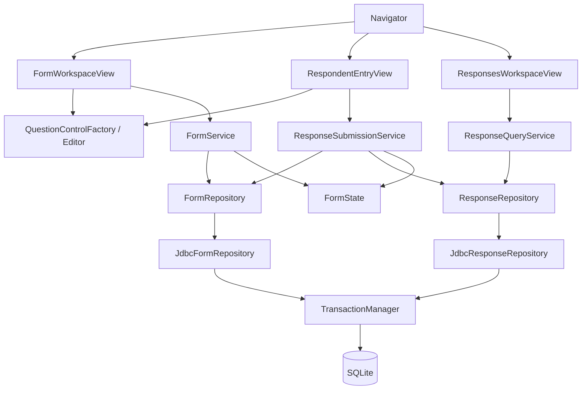

# Phase 2 component diagram

```mermaid
flowchart TB
    N[Navigator] --> FW[FormWorkspaceView]
    N --> RE[RespondentEntryView]
    N --> RW[ResponsesWorkspaceView]
    FW --> QC[QuestionControlFactory / Editor]
    RE --> QC
    FW --> FS[FormService]
    RE --> SS[ResponseSubmissionService]
    RW --> QS[ResponseQueryService]
    FS --> FR[FormRepository]
    SS --> FR
    SS --> RR[ResponseRepository]
    QS --> RR
    FS --> ST[FormState]
    SS --> ST
    FR --> JF[JdbcFormRepository]
    RR --> JR[JdbcResponseRepository]
    JF --> TM[TransactionManager]
    JR --> TM
    TM --> DB[(SQLite)]
```

All JavaFX-to-service calls run through the shared `Async` boundary.
