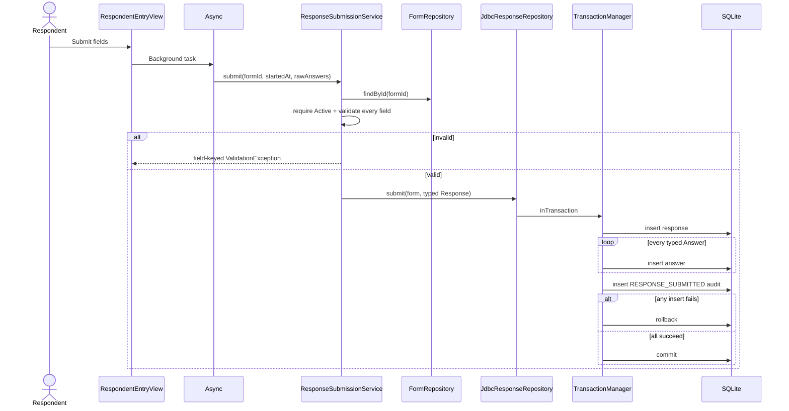

# Phase 2 response submission sequence

```mermaid
sequenceDiagram
    actor Person as Respondent
    participant V as RespondentEntryView
    participant A as Async
    participant S as ResponseSubmissionService
    participant F as FormRepository
    participant R as JdbcResponseRepository
    participant T as TransactionManager
    participant DB as SQLite
    Person->>V: Submit fields
    V->>A: Background task
    A->>S: submit(formId, startedAt, rawAnswers)
    S->>F: findById(formId)
    S->>S: require Active + validate every field
    alt invalid
        S-->>V: field-keyed ValidationException
    else valid
        S->>R: submit(form, typed Response)
        R->>T: inTransaction
        T->>DB: insert response
        loop every typed Answer
            T->>DB: insert answer
        end
        T->>DB: insert RESPONSE_SUBMITTED audit
        alt any insert fails
            T->>DB: rollback
        else all succeed
            T->>DB: commit
        end
    end
```
