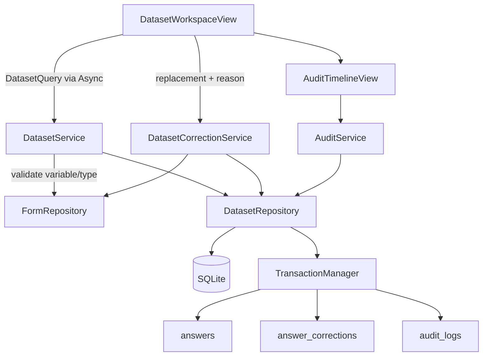

# Phase 3 dataset and correction flow

```mermaid
flowchart TB
    UI[DatasetWorkspaceView] -->|DatasetQuery via Async| DS[DatasetService]
    DS -->|validate variable/type| FR[FormRepository]
    DS --> DR[DatasetRepository]
    DR --> DB[(SQLite)]
    UI -->|replacement + reason| CS[DatasetCorrectionService]
    CS --> DR
    CS --> FR
    DR --> TM[TransactionManager]
    TM --> A[answers]
    TM --> H[answer_corrections]
    TM --> L[audit_logs]
    UI --> AT[AuditTimelineView]
    AT --> AS[AuditService]
    AS --> DR
```

The grid is read-only. Only `DatasetCorrectionService` can enter the correction transaction.
