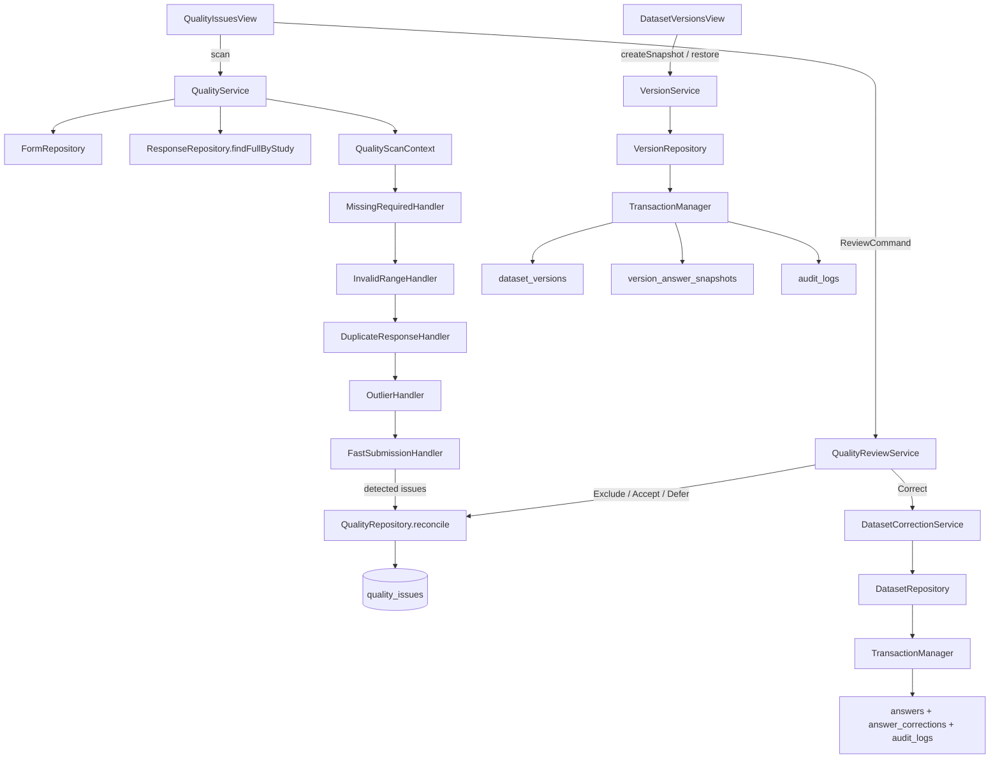

# Phase 4 quality review and versioning flow

Detection never writes to the database; only `QualityRepository.reconcile` (new issues) and a
`ReviewCommand` (status changes) do. `VersionRepository.restore` writes live `answers`/`responses`
to match an older snapshot, then calls the same snapshot routine used by `createSnapshot` to record
the result as a new version — it never edits an existing `dataset_versions` row.
