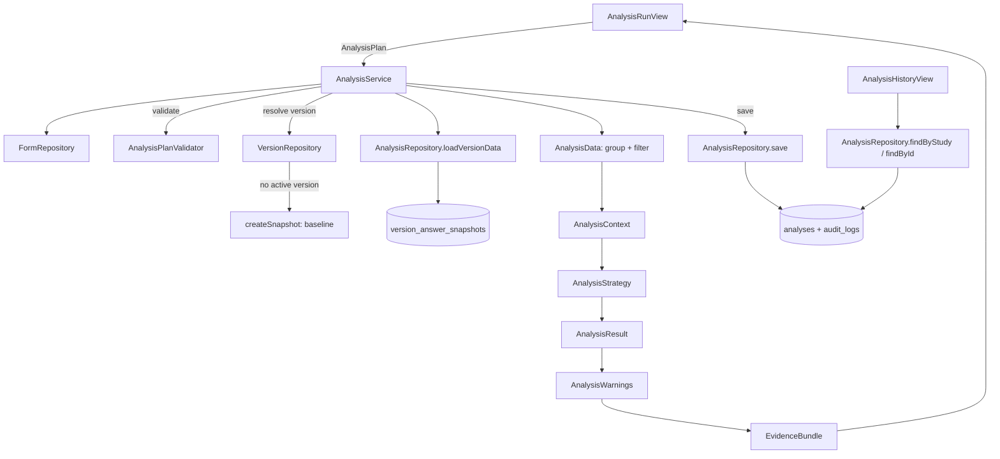

# Phase 5 analysis and evidence flow

Analysis never reads the live `answers` table. `AnalysisRepository.loadVersionData` reconstructs
typed `Answer`s from one dataset version's immutable snapshot, so a stored plan re-run against the
same version reproduces its original result even if the live dataset changes afterward. Validation
(`AnalysisPlanValidator`) runs before any strategy executes; an invalid plan never reaches
`AnalysisContext`.
