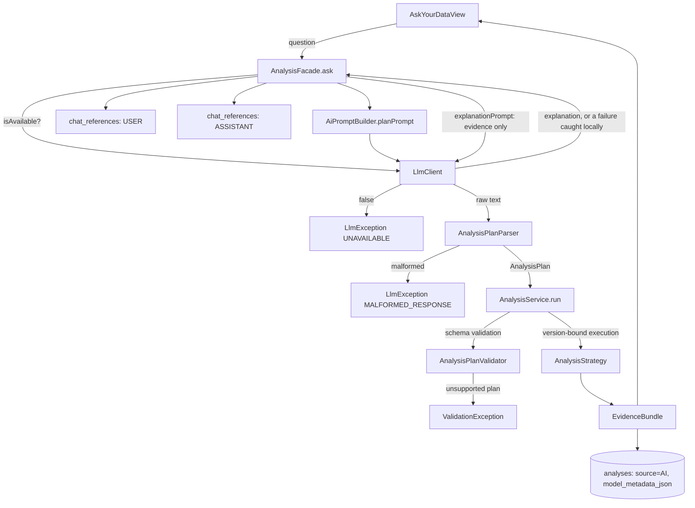

# Phase 6 "Ask Your Data" flow

`AnalysisPlanParser` and `AnalysisPlanValidator` are two independent gates: the parser rejects a
response that isn't even structurally a plan (bad JSON, unknown method, bad variable ID); the
validator — the exact same one manual analysis uses — rejects a structurally valid plan that is
semantically unsupported (wrong variable type, duplicate variables, bad filter). Neither the LLM
nor `AnalysisFacade` can skip either gate. An explanation failure after a successful `AnalysisService.run`
never rolls back or hides the already-persisted evidence — it only changes what text is shown.
