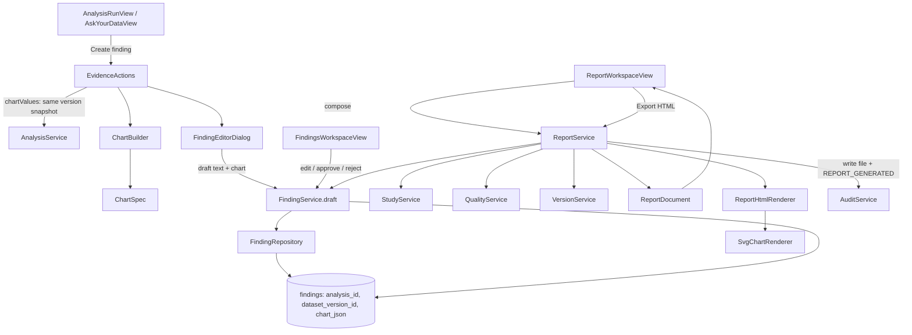

# Phase 7 findings and report flow

A finding's chart is built once, at creation time, from the fresh `EvidenceBundle` and raw
version-bound values, then persisted as `findings.chart_json` — a shape this phase fully controls
(every `ChartSpec` variant is a flat list of primitives). This lets a report re-render the same
chart after a restart without needing to parse the richer, five-shaped `analyses.result_json`.
`ReportService.compose` is never persisted itself; every preview or export is a fresh read of
current Study/quality/version/finding data, so it can never drift from what those tables say.
