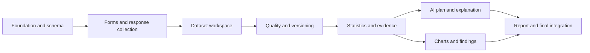

# ResearchFlow AI Development Roadmap

Document location: `docs/planning/DEVELOPMENT_ROADMAP.md`

## 1. Roadmap purpose

This roadmap converts the project documentation into an executable delivery plan for a two-person semester team. The target is not to implement all 25 proposed features at production depth. The target is to prove one reliable, end-to-end research lifecycle:

> Create study -> build and activate form -> collect responses -> inspect and clean data -> create a dataset version -> run a deterministic analysis from a natural-language question -> show evidence and a chart -> approve a finding -> generate a report -> inspect the audit trail.

The implementation should favor correctness, traceability, and a coherent demonstration over feature count.

## 2. Delivery assumptions

- Team: two developers, referred to as Member A and Member B.
- Schedule: 12 development weeks; phases can be compressed if the academic calendar is shorter.
- Platform: Java 21 LTS (or the course-approved Java version), JavaFX, Maven, and SQLite.
- AI runtime: local HTTP-accessible LLM behind an adapter; the application must remain useful when it is unavailable.
- Data collection: local respondent/kiosk/interview mode. Public web forms are out of scope.
- Dataset history: major-version snapshots, not full event sourcing.
- UI target: eight workspaces with persistent study navigation, not one screen per feature.
- Export target: a dependable HTML report first; PDF is optional if time and tooling permit.
- Git: `main` stays demonstrable; feature branches are merged through peer review.

## 3. Scope baseline

### MVP — required for the final demonstration

1. Study management and dashboard.
2. Form builder with a deliberately limited but useful question set.
3. Draft, Active, and Closed form lifecycle.
4. Transactional response collection and SQLite persistence.
5. Dataset table with search, filter, sort, row details, and controlled edits.
6. Deterministic data-quality checks and researcher review.
7. Dataset snapshots, version history, and audit events.
8. Manual deterministic analysis.
9. Natural-language question to validated `AnalysisPlan`.
10. Evidence-backed analysis results and limitation messages.
11. Basic JavaFX charts.
12. Draft, edit, approve, and reject findings.
13. Traceable report generation.
14. Local LLM adapter with timeout, parsing, and offline fallback behavior.

### Reduced MVP — use these limits to protect the schedule

- Question types: short text, number, single choice, multiple choice, yes/no, Likert/rating, and date. Add long text, dropdown, or time only after the collection workflow is stable.
- Quality rules: missing required value, invalid numeric range, exact duplicate response, simple outlier, and unusually fast submission.
- Analysis strategies: frequency/percentage, numeric summary, correlation, cross-tabulation, and one two-group comparison.
- Charts: bar chart, histogram, and scatter plot. Grouped bars are desirable; box plots and heatmaps are optional.
- Reports: study metadata, dataset/version summary, quality summary, selected evidence, charts, approved findings, and limitations.

### Phase 2 — only after the MVP release candidate

- Deterministically computed AI data profiling.
- Researcher-defined response-consistency rules.
- Data-maintenance suggestions.
- Hypothesis tracking.
- Sensitive-field flags, anonymized export, and richer privacy tools.
- Additional quality rules and statistical strategies.

### Deferred / stretch

- Automatic insight discovery across many variables.
- Reusable visual analysis pipelines.
- Dataset merge assistant.
- Advanced or multivariable regression.
- Semantic near-duplicate and contradiction detection.
- Cloud collaboration, public web forms, and multi-tenant accounts.

## 4. Non-negotiable engineering rules

- The LLM interprets and explains; deterministic Java code validates and calculates.
- Never execute AI-generated SQL.
- Every analysis references an explicit `dataset_version_id`.
- Every analytical claim exposes method, variables, filters, sample size, results, warnings, and version.
- Invalid or unsupported AI plans stop before execution and produce a clarification or safe alternative.
- Response submission and multi-table dataset operations are transactional.
- Quality flags never delete or alter data automatically.
- Dataset corrections require researcher confirmation, a reason, and audit/version metadata.
- AI-generated findings remain Draft until explicitly approved.
- JavaFX controllers contain no SQL and no statistical formulas.
- Database, analysis, and LLM work runs off the JavaFX application thread.
- Core collection, maintenance, and manual analysis continue to work without the LLM.

## 5. Target architecture and critical path

Use the following package boundaries:

```text
researchflow/
  app/             startup, configuration, navigation
  ui/              JavaFX views, controllers, reusable components
  domain/          entities, value objects, enums, invariants
  service/         application use cases and transaction coordination
  persistence/     SQLite repositories, migrations, seeders
  quality/         quality-handler chain and issue models
  analysis/        strategies, plan validator, results, evidence
  ai/              LLM client, adapter, prompts, parsers
  visualization/   chart strategies/builders
  report/          report model, rendering, export
  command/         controlled dataset changes
  state/           form lifecycle behavior
  util/            small shared helpers
```

The dependency path that determines the schedule is:



Manual analysis must be completed before AI integration. This keeps the statistical engine testable and prevents the LLM from becoming an accidental dependency for core functionality.

## 6. Milestone roadmap

### Phase 0 — Scope lock and technical spikes (Week 1)

**Goal:** remove high-risk unknowns before feature development.

**Work**

- Confirm Java/JavaFX versions and create an Architecture Decision Record (ADR) for FXML versus programmatic views.
- Confirm SQLite JDBC, JSON library, statistics library, test framework, and local LLM runtime.
- Prototype: JavaFX launches through Maven; SQLite opens with foreign keys enabled; one background task updates the UI safely; one structured LLM response can be parsed.
- Freeze MVP question types, quality checks, analyses, charts, and report format.
- Create the initial ER diagram, domain glossary, wireframes for the eight workspaces, and prioritized backlog.
- Define stable IDs for studies, questions/variables, versions, analyses, and evidence.
- Agree on branch, pull-request, commit, and review conventions.

**Exit gate**

- The application launches with one command.
- A temporary SQLite database can be migrated and queried.
- High-risk technology choices are recorded.
- MVP and deferred scope are signed off by both members.

### Phase 1 — Foundation and Study workspace (Week 2)

**Goal:** establish the application skeleton and the parent research workspace.

**Work**

- Create Maven modules/packages, application configuration, navigation shell, CSS/theme baseline, and error boundary.
- Implement migration runner, connection factory, transaction helper, repository interfaces, and test database utilities.
- Create initial tables for studies, research questions, forms, questions, responses, answers, versions, issues, analyses, findings, audit logs, and chat references.
- Implement Study CRUD, validation, archive behavior, Studies Home, and Study Dashboard shell.
- Add structured local logging without research answer values.
- Seed a small development study.

**Exit gate**

- Study CRUD persists after restart.
- Foreign keys and transaction behavior have repository tests.
- Navigation opens an identifiable study context.
- `mvn test` passes on a clean checkout.

### Phase 2 — Form design and transactional collection (Weeks 3–4)

**Goal:** build the first complete business workflow from questionnaire design to stored answers.

**Work**

- Implement `Form`, `Section`, `Question`, `QuestionOption`, `Response`, and `Answer` domain models.
- Implement Form State behavior: Draft permits structural edits; Active accepts submissions; Closed rejects submissions.
- Implement `QuestionControlFactory` for the reduced-MVP question types.
- Build Form Builder: add/edit/delete/reorder questions, type settings, required flag, options, and numeric validation.
- Build preview and respondent-entry views.
- Validate required fields, numeric types/ranges, choices, and dates at both UI and service boundaries.
- Save a Response and all Answers in one transaction.
- Record activation, closure, and submission audit events.
- Add respondent/researcher mode separation in navigation.

**Exit gate**

- A user can create, activate, complete, and close a form.
- Invalid answers show field-level messages.
- Forced insert failure leaves no partial response.
- State and response-submission integration tests pass.

### Phase 3 — Dataset workspace and audit baseline (Week 5)

**Goal:** make collected data inspectable without bypassing application rules.

**Work**

- Map question IDs to stable dataset variables and human-readable labels.
- Build the spreadsheet-style dataset table with pagination or bounded loading.
- Add sort, search, simple typed filters, response detail, and missing-value display.
- Add controlled single-value correction entry points; do not write directly from table cells.
- Implement audit-log queries and a basic timeline panel.
- Add indexes for study, form, response, question, version, analysis, status, and timestamp access paths.

**Exit gate**

- Seeded responses render correctly and can be located through search/filter.
- A correction cannot bypass validation or audit recording.
- Dataset operations stay responsive with the planned 100–300-record demo dataset.

### Phase 4 — Quality review and dataset versioning (Week 6)

**Goal:** create a reviewable and reproducible cleaning workflow.

**Work**

- Implement `QualityHandler` and the core handler chain.
- Persist `QualityIssue` type, severity, affected records/variables, explanation, status, and resolution note.
- Build the issue queue, details, filters, and review actions: correct, exclude, retain/accept, and defer.
- Implement Command objects for corrections and exclusions.
- Create version snapshots after meaningful cleaning batches, including parent, reason, timestamp, and change summary.
- Support version list, compare summary, active-version selection, and safe restore by creating a new version rather than rewriting history.
- Make bulk actions show affected counts and require confirmation.

**Exit gate**

- Known dirty seed data triggers the expected rules without flagging clean controls.
- Resolving an issue creates audit metadata and a reproducible version.
- Earlier snapshots remain unchanged and queryable.
- Quality-chain and command tests pass.

### Phase 5 — Deterministic analysis and evidence (Weeks 7–8)

**Goal:** make calculations correct, reusable, version-bound, and independently usable.

**Work**

- Define `AnalysisPlan`, structured filters, `AnalysisContext`, `AnalysisResult`, and `EvidenceBundle` contracts.
- Implement schema-aware plan validation: variable existence, type compatibility, method whitelist, filter validation, and explicit dataset version.
- Implement `AnalysisStrategy`, strategy registry/factory, and the reduced-MVP strategies.
- Use a proven math library where appropriate; keep orchestration and assumptions in application code.
- Add deterministic warnings for small sample, heavy missingness, unsupported assumptions, and non-causal interpretation.
- Persist plan, parameters, result, sample size, warnings, timestamps, and version reference.
- Build a manual analysis panel and evidence panel before natural-language input.
- Verify calculations using known datasets and externally established expected results.

**Exit gate**

- All supported analyses run without AI.
- Invalid variable/method combinations are rejected before calculation.
- Re-running a stored plan against the same version reproduces the result.
- Statistical tests use tolerances and known expected outputs.

### Phase 6 — Local AI and “Ask Your Data” (Week 9)

**Goal:** add language access without transferring mathematical authority to the model.

**Work**

- Define `LlmClient` and implement a local-runtime adapter with configuration, health check, timeout, cancellation, and clear error mapping.
- Provide the LLM with variable IDs, labels, types, supported operations, and a strict `AnalysisPlan` schema.
- Parse model output defensively; reject extra/unknown methods, variables, and filters.
- Implement `AnalysisFacade`: interpret -> validate -> choose strategy -> execute -> store evidence -> chart request -> explain.
- Constrain the explanation prompt to the stored `EvidenceBundle` and permitted research labels.
- Store model/runtime identifier and prompt-template version with AI-produced text.
- Resolve follow-up questions through analysis IDs instead of resending the complete dataset.
- Preserve manual analysis and evidence access when AI is offline.

**Exit gate**

- At least five representative natural-language questions map to valid plans.
- Malformed, hallucinated, or unsupported plans never execute.
- AI explanations cannot alter stored result values.
- Unavailable/slow AI produces a recoverable message while manual analysis still works.

### Phase 7 — Visualization, findings, and reporting (Week 10)

**Goal:** turn verified evidence into reviewable research outputs.

**Work**

- Implement chart selection/builders over structured result data, not raw AI prose.
- Add bar, histogram, and scatter charts with titles, labels, sample size, and version reference.
- Generate a draft finding from selected evidence; allow edit, approve, and reject.
- Preserve analysis/version links when finding wording changes.
- Build report composition from stored study data, quality summary, evidence, charts, approved findings, and limitations.
- Add report preview and HTML export; record generation in the audit log.

**Exit gate**

- Every chart can be traced to a stored analysis and version.
- Unapproved findings are excluded from the final report by default.
- A report remains consistent with its referenced evidence after restart.

### Phase 8 — Integration, hardening, and release candidate (Weeks 11–12)

**Goal:** produce a stable, explainable, repeatable final submission.

**Work**

- Run all four end-to-end workflows and fix integration gaps.
- Add cancellation/progress behavior for quality scans, analysis, report generation, and LLM requests.
- Test database failure, malformed AI output, unavailable AI, empty datasets, missing variables, and snapshot restore.
- Review prepared statements, foreign keys, deletion behavior, logs, and sensitive-data exposure.
- Prepare a realistic 100–300-response seed study with known distributions, missing values, one duplicate, one range issue, and a known relationship.
- Add automated acceptance tests where practical and a manual smoke-test checklist for JavaFX.
- Update ER, class, sequence, and component diagrams to match the implementation.
- Create installation/run instructions, architecture summary, limitations, and known-issues list.
- Conduct a clean-machine rehearsal and final demonstration rehearsal.
- Tag the release candidate only after the complete demo path succeeds twice from a fresh database.

**Exit gate**

- Clean checkout -> build -> test -> run is documented and repeatable.
- The seeded final-demo story completes without manual database intervention.
- No critical/high defect remains open.
- Both members can explain the data model, patterns, AI boundary, statistics, and failure modes.

## 7. Team split and collaboration model

| Area | Member A lead | Member B lead | Shared responsibility |
|---|---|---|---|
| Foundation | JavaFX shell, navigation, UI conventions | schema, repositories, transactions | domain model and ADRs |
| Collection | form builder, question controls, respondent UX | validation services, response transaction | State pattern and tests |
| Dataset | table, search/filter, response details | query services, indexes, audit persistence | controlled-edit contract |
| Quality/versioning | issue-review UI | handler chain, Commands, snapshots | integration tests and review |
| Analysis | manual-analysis and evidence UI | validator, strategies, math tests | result contracts and acceptance cases |
| AI | chat interaction and progress states | adapter, structured parsing, facade | prompt tests and fallback UX |
| Outputs | charts and findings workflow | report composition/export | evidence traceability |
| Release | usability and demo rehearsal | reliability and data checks | documentation, bug fixes, viva preparation |

Ownership is a lead assignment, not exclusive control. Every shared contract should be reviewed by the other member. Each member should contribute implementation, tests, reviews, documentation, and integration commits throughout the project.

## 8. Backlog structure

Organize the issue tracker into these epics:

- `E01 Foundation and persistence`
- `E02 Study workspace`
- `E03 Form lifecycle and builder`
- `E04 Response collection`
- `E05 Dataset exploration`
- `E06 Quality and versioning`
- `E07 Deterministic analysis`
- `E08 AI interpretation and explanation`
- `E09 Visualization and evidence`
- `E10 Findings and reporting`
- `E11 Reliability, testing, and release`

Every story should include:

- user-visible outcome;
- business rules and validation;
- schema/repository impact;
- audit/version impact;
- failure and empty-state behavior;
- test cases;
- documentation or diagram impact;
- explicit exclusions.

## 9. Test and quality strategy

| Level | Minimum coverage target |
|---|---|
| Domain/unit | form states, validators, filters, quality handlers, commands, plan validation, limitation rules |
| Statistical unit | known input datasets and expected frequency, mean, median, SD, correlation, crosstab, and group-comparison results |
| Repository | CRUD, foreign keys, prepared queries, deletion policy, snapshots, and temporary-database migrations |
| Integration | response transaction, quality resolution/version creation, manual analysis/evidence persistence, AI-plan pipeline, finding/report traceability |
| Failure | database rollback, malformed AI JSON, unsupported plan, timeout/offline AI, missing variables, empty/insufficient data |
| Acceptance | the seeded final-demo lifecycle and the four documented workflows |
| UI smoke | navigation, validation messages, background progress/cancel, empty states, report preview, restart persistence |

Tests must not call a real LLM during the standard build. Use a fake `LlmClient` with valid, invalid, unsupported, and timeout fixtures. A small optional contract test may exercise the chosen local runtime outside the default test suite.

## 10. Definition of Done

A feature is complete only when all applicable items are true:

- Domain/service behavior has one clear owner and no business logic is hidden in a controller.
- Schema migration and repository behavior are implemented and tested.
- Input validation and user-safe error handling are present.
- Data-changing actions include audit and version behavior where required.
- Long-running work does not block the JavaFX thread.
- Unit or integration tests cover the main rule and at least one failure path.
- UI includes loading, empty, success, and failure states.
- Seed/demo data proves the feature.
- Architecture and user documentation are updated.
- Another team member reviewed the change.
- The feature works after application restart.

## 11. Risk controls and scope triggers

| Risk / trigger | Required response |
|---|---|
| Phase is more than one week late | Drop optional question types and chart types before compressing tests. |
| Form/response workflow is not stable by end of Week 4 | Freeze all Phase 2 work and focus only on the critical path. |
| Snapshot versioning is too slow or complex | Version only after confirmed cleaning batches; retain metadata per command. |
| Statistical method is difficult to verify | Remove it from MVP rather than ship an uncertain calculation. |
| Local LLM is unreliable on demo hardware | Use a smaller model and keep a clearly demonstrated manual-analysis fallback. |
| AI cannot consistently produce valid plans | Offer a constrained UI-assisted question builder and treat free text as an optional layer. |
| Report/PDF tooling causes delays | Ship self-contained HTML export and make PDF optional. |
| UI performance degrades | Bound table loading, index queries, and pass only selected version/variables to analysis. |
| More than five critical defects exist in Week 11 | Stop feature work and run a release-only defect triage. |

## 12. Release deliverables

The final project package should contain:

- source code and Maven configuration;
- reproducible SQLite migrations and seed data;
- automated test suite and test summary;
- README with prerequisites, build, run, reset, and demo instructions;
- ER diagram, architecture/component diagram, key class diagram, and Ask-Your-Data sequence diagram;
- design-pattern rationale tied to Strategy, Chain of Responsibility, Command, State, Adapter, and Facade;
- local LLM setup plus documented offline fallback;
- known limitations and future-work list;
- final demonstration script and backup screenshots/sample report;
- contribution evidence through branches, commits, reviews, and issue history.

## 13. Final demonstration acceptance script

The release is ready when a presenter can reliably complete this sequence:

1. Create or open the seeded study and show its objectives.
2. Build or inspect a form, activate it, and submit a response.
3. Open the dataset and locate the new response.
4. Run quality checks and resolve one known issue.
5. Create/show a new dataset version and its audit event.
6. Ask a supported natural-language research question.
7. Show the validated plan, deterministic result, sample size, warnings, version, and chart.
8. Disable or simulate failure of the LLM and show that manual analysis still works.
9. Generate, edit, and approve a finding.
10. Generate the traceable report and open the audit timeline.

This is the project’s primary success criterion. Phase 2 or stretch work should not begin unless this path is already stable.
